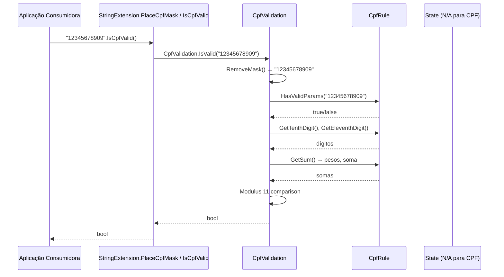
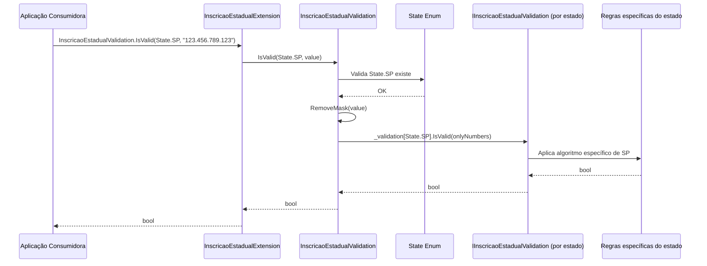

# Arquitetura e Stack Tecnológico — Sirb.Validation

> **Arquivo de destino:** `docs/architecture-tech-stack.md` (na raiz de `/docs`).
> Este documento é **obrigatório e não negociável** — registra arquitetura, stack tecnológico, integrações, decisões e observações do sistema. Deve ser criado na primeira documentação do projeto e mantido em toda a evolução. É **contínuo e cumulativo**: nunca sobrescrever conteúdo anterior, apenas evoluí-lo.

## Metadados

> **Nota:** Esta seção é uma reflexão do frontmatter YAML (bloco `---` no topo do arquivo) para leitura humana. O frontmatter é a fonte primária; qualquer divergência entre os dois deve ser resolvida atualizando o frontmatter primeiro.

- **Código do documento:** `architecture-tech-stack`
- **Título:** Arquitetura e Stack Tecnológico — Sirb.Validation
- **Data de criação:** 26/07/2026
- **Última atualização:** 31/07/2026
- **Autor:** Rodrigo Araujo Barbosa
- **Versão:** 1.2.0
- **Status:** Aprovado

## 1. Visão Geral do Sistema

**Sirb.Validation** é uma biblioteca .NET (NuGet package) **stateless, puramente computacional**, para validação, formatação (máscara) e geração de documentos brasileiros (CPF, CNPJ **numérico e alfanumérico (IN 2.229/2024)**, PIS, Título de Eleitor, Inscrição Estadual de todos os 27 estados + DF, Renavam) e utilitários de string.

- **Tipo:** Class Library (NuGet)
- **Público-alvo:** Desenvolvedores .NET construindo aplicações que processam documentos brasileiros
- **Modelo de execução:** In-process, síncrono, sem I/O, sem estado, thread-safe
- **Filosofia:** Zero dependências externas (apenas BCL), allocation-free no hot path, 100% testado, documentado via XML docs

## 2. Componentes e Responsabilidades

| Componente | Localização | Responsabilidade | Padrão |
|------------|-------------|------------------|--------|
| **Rules** | `Documents/BR/Rules/` | Algoritmos puros de validação (cálculo de dígitos verificadores, pesos, módulo 11/9). Sem I/O, sem estado. | Funções puras, `static`, testáveis isoladamente |
| **Validation** | `Documents/BR/Validation/` | Orquestração: remove máscara, delega para Rules, aplica máscara de saída. Expõe `IsValid`, `PlaceMask`, `RemoveMask`. | Facade stateless |
| **Interfaces** | `Documents/BR/Interfaces/` | Contrato `IInscricaoEstadualValidation` para polimorfismo por estado. | Interface + implementações por estado |
| **State Enum** | `Documents/BR/Enumeration/State.cs` | Enumeração de 27 UFs + DF. Usada como chave de roteamento para IE. | `enum` com XML docs |
| **Mockups (Test-only)** | `Documents/BR/Mockups/` | Geradores de documentos válidos para testes (`Cpf.Generate()`, `Cnpj.Generate()`, `InscricaoEstadual.Generate(State)`). **Marcados como `internal` via `InternalsVisibleTo`**. | Factory pattern, uso restrito a testes |
| **Extensions (Public API)** | `Extensions/` | **API pública consumidor**: métodos de extensão `string.IsCpfValid()`, `string.PlaceCpfMask()`, etc. Delegam para `Validation`. | Extension methods, fluent API |
| **Exceptions** | `Exceptions/` | `StateNotFoundException` (lançada se estado inválido passado para IE). Extensions para CPF/CNPJ. | Custom exceptions, helper `ThrowIf` |
| **String Utilities** | `Extensions/StringExtension.cs` | Utilitários genéricos: `OnlyNumbers()`, `RemoveMask()`, `NoNumbers()`, `ToCapitalize()`, `RemoveLatinCharacters()`, `Reverse()`. | Extension methods |

## 3. Stack Tecnológico com Versões

| Camada | Tecnologia | Versão | Justificativa |
|--------|------------|--------|---------------|
| **Runtime** | .NET | 8.0, 9.0, 10.0 (multi-target) | LTS atuais + preview; suporte a `Span<char>`, `stackalloc`, `Nullable` context |
| **Build** | MSBuild / `dotnet CLI` | SDK 8.0+ | Build nativo, multi-targeting nativo |
| **Package Manager** | NuGet | 6.x | Padrão .NET |
| **Dependências** | Nenhuma (apenas BCL) | - | `System.Globalization` removido (já incluso no BCL) |
| **Test Framework** | xUnit | 2.6+ | Padrão .NET, paralelismo, theory/inline data |
| **Test Runner** | `dotnet test` + `xunit.runner.visualstudio` | - | CI/CD nativo |
| **Coverage** | coverlet.collector | 6.0+ | Cobertura de linha/branch, integração com SonarCloud/Codecov |
| **Benchmark** | BenchmarkDotNet | 0.14+ | Microbenchmarks rigorosos, `MemoryDiagnoser`, `DisassemblyDiagnoser` |
| **Static Analysis** | Roslyn Analyzers (`Microsoft.CodeAnalysis.NetAnalyzers`, `StyleCop.Analyzers`) | Latest | `TreatWarningsAsErrors`, `Nullable=enable` |
| **Formatting** | `dotnet format` | SDK built-in | EditorConfig-driven |
| **CI/CD** | GitHub Actions | - | Build, test, benchmark, pack, publish em PR e release |
| **Versionamento** | GitVersion / Conventional Commits | - | SemVer automático a partir de commits |
| **Documentação** | XML Docs + Markdown (skill `documentation`) | - | XML para IntelliSense/NuGet; Markdown para docs externas |
| **Licença** | MIT | - | Permissiva, compatível com uso comercial |

### Target Frameworks (multi-targeting)

```xml
<TargetFrameworks>net8.0;net9.0;net10.0</TargetFrameworks>
```

> **Nota:** `.NET Framework`, `.NET Standard`, `.NET Core 3.1`, `.NET 5/6/7` foram removidos na v1.5.0 (ver `README.md` histórico).

## 4. Mapa de Integração (C4 Container Level)

```mermaid
flowchart LR
    subgraph ConsumerApp[Aplicação Consumidora]
        direction TB
        AppCode[Código da Aplicação]
        DI[DI Container]
        Logger[ILogger]
        Metrics[Meter/ActivitySource]
    end

    subgraph SirbValidation[Sirb.Validation (NuGet)]
        direction TB
        Ext[Extensions API\n(string.IsCpfValid(),\nPlaceCpfMask(), etc.)]
        ExtAlpha[Extensions API\n(IsCnpjAlfanumericoValid(),\nPlaceCnpjAlfanumericoMask())]
        Val[Validation Layer\n(CpfValidation, CnpjValidation,\nInscricaoEstadualValidation,\nCnpjAlfanumericoValidation)]
        Rules[Rules Layer\n(CpfRule, CnpjRule, PisRule,\nRenavanRules, CnpjAlfanumericoRule,\nIE por estado)]
        Enum[State Enum\n(27 UFs + DF)]
        Mock[Mockups (internal)\nCpf.Generate(), etc.]
    end

    subgraph External[Externo]
        NuGet[nuget.org]
        GitHub[GitHub Repo\n(Source, CI, Issues)]
        Bench[BenchmarkDotNet\n(Performance CI)]
    end

    AppCode -->|using Sirb.Validation.Extensions| Ext
    AppCode -->|using Sirb.Validation.Extensions| ExtAlpha
    Ext --> Val
    ExtAlpha --> Val
    Val --> Rules
    Val --> Enum
    Val -.->|internal| Mock
    DI -.->|Registra serviços se necessário| AppCode
    Logger -.->|Log validações| AppCode
    Metrics -.->|Mede latência| AppCode

    SirbValidation -->|dotnet pack\nnuget push| NuGet
    GitHub -->|CI/CD| SirbValidation
    Bench -.->|Benchmarks em CI| SirbValidation

    style SirbValidation fill:#f0f8ff,stroke:#336699,stroke-width:2px
    style ConsumerApp fill:#fff8e1,stroke:#f5a623,stroke-width:2px
    style External fill:#f3e5f5,stroke:#8e24aa,stroke-width:1px,stroke-dasharray: 5 5
```

## 5. Fluxo de Dados

### 5.1 Validação de CPF (Exemplo Representativo)



### 5.2 Validação de Inscrição Estadual (Roteamento por Estado)



### 5.3 Geração de Documentos (Apenas Testes)

```mermaid
flowchart TD
    TestCode[Teste xUnit] --> Mock[Mockups.*Generate()]
    Mock --> Rules[Rules Layer]
    Rules --> ValidDoc[Documento Válido]
    ValidDoc --> TestCode
    note right of Mock: internal\nInternalsVisibleTo\napenas Sirb.Validation.Test
```

## 6. Integrações Externas

| Integração | Tipo | Detalhes |
|------------|------|----------|
| **nuget.org** | Publicação | `dotnet pack` → `nuget push` em CI (GitHub Actions). Package ID: `Sirb.Validation`. README.md empacotado como `PackageReadmeFile`. |
| **GitHub** | Source + CI/CD | Repositório: `github.com/rodabarbosa/ValidationNuget`. GitHub Actions para: build, test, coverage, benchmark, pack, publish. |
| **GitHub Actions** | CI/CD | Workflows: `build.yml`, `test.yml`, `benchmark.yml`, `publish.yml`. Triggers: PR, push to `main`, tags `v*`. |
| **SonarCloud / CodeQL** | Análise estática | Opcional: configurado via GitHub Actions para SAST/SCA. |
| **Dependabot** | Atualização de dependências | Habilitado para `Microsoft.NET.Test.Sdk`, `xunit`, `BenchmarkDotNet`, `coverlet.collector`. |
| **BenchmarkDotNet** | Performance CI | Executa benchmarks em PRs; falha se regressão > 10% (configurável). |

## 7. Infraestrutura e Build

### 7.1 Estrutura da Solution

```text
Sirb.Validation.sln
├── Core/
│   └── Sirb.Validation/          # Biblioteca principal (NuGet)
├── Test/
│   └── Sirb.Validation.Test/     # Testes xUnit (100% coverage target)
├── Benchmark/
│   └── Sirb.Validation.Benchmark/# BenchmarkDotNet
```

### 7.2 Build Pipeline (GitHub Actions - Resumo)

```yaml
# Pseudocódigo do pipeline
jobs:
  build:
    runs-on: ubuntu-latest
    steps:
      - dotnet restore
      - dotnet build --configuration Release --no-restore
      - dotnet format --verify-no-changes
  
  test:
    needs: build
    runs-on: ubuntu-latest
    steps:
      - dotnet test --configuration Release --no-build \
          --collect:"XPlat Code Coverage" \
          --results-directory coverage
      - reportgenerator (coverage report)
      - upload to SonarCloud/Codecov
  
  benchmark:
    needs: build
    runs-on: ubuntu-latest
    steps:
      - dotnet run --project Sirb.Validation.Benchmark --configuration Release
      - compare with baseline (fail if regression > 10%)
  
  pack:
    needs: [test, benchmark]
    if: github.event_name == 'push' && startsWith(github.ref, 'refs/tags/v')
    runs-on: ubuntu-latest
    steps:
      - dotnet pack --configuration Release -o artifacts
      - nuget push artifacts/*.nupkg -Source nuget.org
```

### 7.3 Configurações de Build (Directory.Build.props / .csproj)

- `Nullable=enable` — Nullable reference types obrigatórios
- `TreatWarningsAsErrors=true` — Zero warnings
- `GenerateDocumentationFile=true` — XML docs para NuGet/IntelliSense
- `InternalsVisibleTo="Sirb.Validation.Test"` — Expõe mockups apenas para testes
- `Deterministic=true` — Builds reprodutíveis
- `ContinuousIntegrationBuild=true` — Para SourceLink

## 8. Observabilidade

| Aspecto | Implementação |
|---------|---------------|
| **Logging** | Biblioteca **não loga**. Aplicação consumidora injeta `ILogger` e loga chamadas/resultados se desejado. |
| **Métricas** | Biblioteca **não emite métricas**. Aplicação consumidora usa `System.Diagnostics.Meter` para medir latência/contagem de validações. |
| **Tracing** | Biblioteca **não cria ActivitySource**. Aplicação consumidora pode envolver chamadas em `ActivitySource.StartActivity("ValidateCpf")` para distributed tracing. |
| **Benchmarks** | Projeto dedicado `Sirb.Validation.Benchmark` com `MemoryDiagnoser`. Executa em CI. Baselines armazenadas em `benchmarks/baseline.json` (artefato). |
| **Health Checks** | N/A — biblioteca stateless sem dependências externas. |

## 9. Implicações de Segurança

| Vetor | Mitigação |
|-------|-----------|
| **Injeção (OWASP A03)** | Validação estrita via regex + algoritmos matemáticos determinísticos. Entrada sanitizada por `RemoveMask()` (apenas dígitos). |
| **Dados sensíveis em logs** | Biblioteca não loga. **Documentação (README, XML docs) alerta**: "Não logar CPF/CNPJ brutos. Use `PlaceMask()` ou `RemoveMask()` antes." |
| **Dependências vulneráveis** | Zero dependências de terceiros. `Dependabot` + `dotnet list package --vulnerable` em CI. |
| **Denial of Service (ReDoS)** | Regexes são simples (`\d{3}\.?\d{3}\.?\d{3}-?\d{2}`), sem backtracking catastrófico. Entrada limitada a 14-15 chars (docs brasileiros). |
| **Segredos no pacote** | `dotnet pack` exclui `.git`, `.github`, `docs/`, `*.md` (exceto README). `InternalsVisibleTo` apenas para teste. |
| **Supply Chain** | Build reproduzível (`Deterministic=true`), SourceLink habilitado, assinatura de pacote (opcional, `SignPackage`). |

## 10. Referências a ADRs

> Esta seção lista ADRs (Architecture Decision Records) que afetam a arquitetura/stack. ADRs ficam em `docs/architecture/adrs/`.

| ADR | Título | Status | Data | Link |
|-----|--------|--------|------|------|
| ADR-001 | Multi-targeting .NET 8/9/10 apenas (remover legacy) | Aceito | 26/07/2026 | `docs/architecture/adrs/ADR-001-multi-targeting-net8-plus.md` |
| ADR-002 | Zero dependências externas (exceto BCL) | Aceito | 26/07/2026 | `docs/architecture/adrs/ADR-002-zero-external-deps.md` |
| ADR-003 | API pública via Extension Methods | Aceito | 26/07/2026 | `docs/architecture/adrs/ADR-003-extension-methods-api.md` |
| ADR-004 | Mockups internos visíveis apenas para testes | Aceito | 26/07/2026 | `docs/architecture/adrs/ADR-004-internal-mockups.md` |
| ADR-005 | BenchmarkDotNet em CI com gate de regressão | Aceito | 26/07/2026 | `docs/architecture/adrs/ADR-005-benchmark-gate.md` |
| ADR-006 | Correção de 6 bugs em código-fonte para 100% de cobertura (RN, TO, PE, PI, SP, CPF) | Aceito | 02/08/2026 | `docs/architecture/adrs/ADR-006-fix-source-bugs-100-coverage.md` |

## 11. Limitações Conhecidas e Evolução Futura

| Área | Descrição | Status |
|------|-----------|--------|
| **CNPJ Alfanumérico (Novo Formato RFB / IN 2.229/2024)** | Suporte implementado via **req-0019**: validação (módulo 11 + ASCII-48), máscara (`XX.XXX.XXX/XXXX-XX`), geração para testes (`CnpjAlfanumerico.Generate()`), API pública (`IsCnpjAlfanumericoValid()`, `PlaceCnpjAlfanumericoMask()`). Retrocompatível com CNPJ numérico legado (14 dígitos). | **Implementado** (req-0019, v1.2.0) |

## 12. Histórico de Alterações

| Data | Autor | Versão | Alteração |
| ---- | ----- | ------ | --------- |
| 31/07/2026 | Rodrigo Araujo Barbosa | 1.2.0 | Implementado CNPJ Alfanumérico (req-0019): Rules/CnpjAlfanumericoRule.cs, Validation/CnpjAlfanumericoValidation.cs, Extensions/CnpjAlfanumericoExtension.cs, Mockups/CnpjAlfanumerico.cs; C4 atualizado; limitação resolvida |
| 31/07/2026 | Rodrigo Araujo Barbosa | 1.1.0 | Removida dependência `System.Globalization` (desnecessária, já no BCL); build agora com 0 warnings; adicionada seção de limitações conhecidas (CNPJ alfanumérico) |
| 26/07/2026 | Rodrigo Araujo Barbosa | 1.0.0 | Criação do documento base (arquitetura, stack, integrações, observabilidade, segurança, ADRs) |

## 12. Esclarecimentos

| Data | Pergunta | Resposta | Status | Origem | Impacto |
| ---- | -------- | -------- | ------ | ------ | ------- |
| 26/07/2026 | A biblioteca deve suportar .NET Framework 4.8? | Não. Decisão ADR-001: apenas .NET 8+ (modern, performático, suporte a Span). | Resolvido | Criação | Define TargetFrameworks e remove legado. |
| 26/07/2026 | Deve haver injeção de dependência para validadores? | Não. Biblioteca stateless, API via extension methods. Simples, performático, sem container. | Resolvido | Criação | Define ARCH-01, ARCH-02. |
| 26/07/2026 | Como versionar a API pública? | SemVer via Conventional Commits. Breaking change = MAJOR. | Resolvido | Criação | Define PROC-02, ARCH-02. |
| 26/07/2026 | Benchmarks devem rodar em todo PR? | Sim. Gate de regressão > 10% falha o build. ADR-005. | Resolvido | Criação | Define PERF-07, PERF-08. |
| 26/07/2026 | A biblioteca deve implementar logging próprio? | Não. Observabilidade é responsabilidade do consumidor. ARCH-03. | Resolvido | Criação | Define ARCH-03, SEC-05. |
| 02/08/2026 | Branches mortos e null checks em IE validations + CpfValidation impedem 100% de cobertura? | Sim. ADR-006 aprova a correção de 6 bugs em código-fonte (RN, TO, PE, PI, SP, CPF) para atingir 100% L e 100% B. Zero breaking change na API pública. | Resolvido | ADR-006 | Libera Wave 7 (Tasks 31–36) do plano 004-100-coverage-tests.md. |