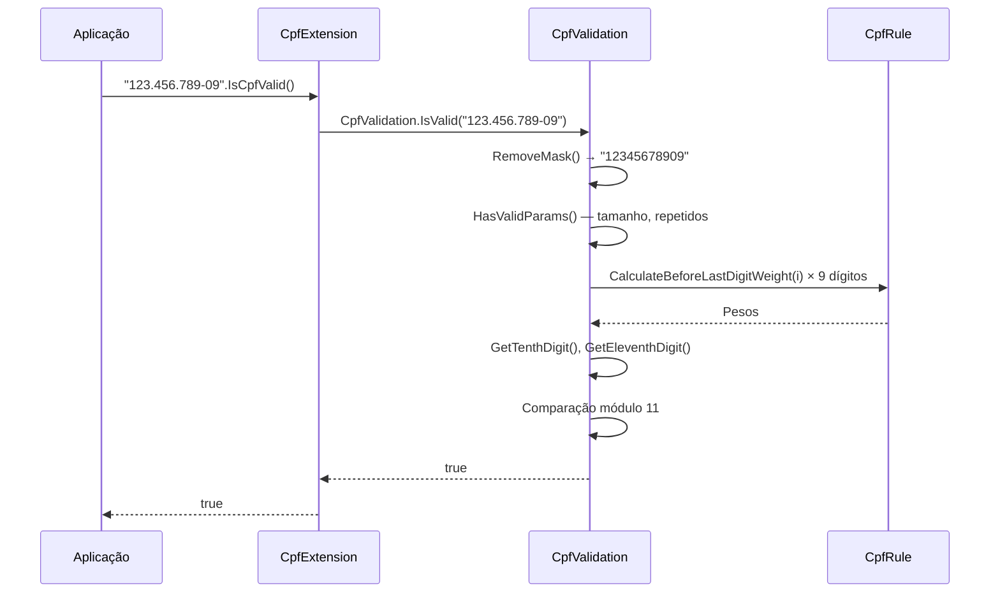

# tec-req-0001 — CPF — Validação e Máscara (Especificação Técnica)

## Metadados

> **Nota:** Esta seção é uma reflexão do frontmatter YAML (bloco `---` no topo do arquivo) para leitura humana. O frontmatter é a fonte primária; qualquer divergência entre os dois deve ser resolvida atualizando o frontmatter primeiro.

- **Código do documento:** `tec-req-0001`
- **Título:** CPF — Validação e Máscara — Especificação Técnica
- **Data de criação:** 27/07/2026
- **Última atualização:** 27/07/2026
- **Autor:** Rodrigo Araujo Barbosa
- **Versão:** 1.0.0
- **Status:** Aprovado
- **Requisito de negócio relacionado:** `req-0001-cpf-validacao-mascara.md` (v1.0.0)

## 1. Resumo do requisito de negócio

- **Requisito de origem:** `req-0001-cpf-validacao-mascara.md` (versão 1.0.0)
- **Síntese do "o quê":** Validar sintaticamente CPF (11 dígitos, módulo 11), aplicar/remover máscara `000.000.000-00` e identificar estado emissor.
- **Síntese do "por quê":** Garantir que CPFs com dígitos verificadores incorretos ou sequências inválidas sejam rejeitados antes de integrações com sistemas externos, reduzindo retrabalho e melhorando qualidade dos dados.

## 2. Detalhamento técnico completo

### 2.1 Arquitetura de camadas

```
Extensions (API Pública)
  └── CpfExtension.cs               (IsCpfValid, PlaceCpfMask via extension methods)
Validation (Orquestração)
  └── CpfValidation.cs               (IsValid, PlaceMask, GetIssuingState, RemoveMask)
Rules (Algoritmos puros)
  └── CpfRule.cs (internal)          (CalculateBeforeLastDigitWeight, CalculateLastDigitWeight)
```

### 2.2 Algoritmo de validação (módulo 11)

O CPF possui 11 dígitos (ddd.ddd.ddd-dd), onde os dois últimos são dígitos verificadores:

**1º dígito verificador (10ª posição):**
- Multiplicar cada um dos 9 primeiros dígitos pelos pesos 10, 9, 8, 7, 6, 5, 4, 3, 2
- Somar os produtos
- Calcular `resto = soma % 11`
- Se `resto < 2`, dígito = 0; senão dígito = 11 - resto

**2º dígito verificador (11ª posição):**
- Multiplicar cada um dos 10 primeiros dígitos pelos pesos 11, 10, 9, 8, 7, 6, 5, 4, 3, 2
- Somar os produtos
- Calcular `resto = soma % 11`
- Se `resto < 2`, dígito = 0; senão dígito = 11 - resto

### 2.3 Validações de entrada

- String vazia ou nula → `false`
- Tamanho diferente de 11 → `false`
- Sequências de dígitos repetidos (00000000000 a 99999999999) → `false`
- Caracteres não numéricos são removidos automaticamente via `RemoveMask()` (alias para `OnlyNumbers()`)
- Exceções: apenas `InvalidOperationException` em `GetIssuingState` para CPF inválido

### 2.4 Máscara

- Formato: `000.000.000-00`
- Regex: `(\d{3})(\d{3})(\d{3})(\d{2})` → substituição por `$1.$2.$3-$4`
- Entrada vazia/nula → retorna `default` (null)

### 2.5 Estado Emissor

O 9º dígito do CPF indica a UF de emissão:

| 9º dígito | UF(s) emissora(s) |
|-----------|--------------------|
| 0 | RS |
| 1 | DF, GO, MS, TO |
| 2 | AC, AP, AM, PA, RO, RR |
| 3 | CE, MA, PI |
| 4 | PE, RN, PB, AL |
| 5 | BA, SE |
| 6 | MG |
| 7 | RJ, ES |
| 8 | SP |
| 9 | PR, SC |

## 3. Regras funcionais e regras de negócio numeradas

### Regras funcionais (RF)

| ID | Descrição | Prioridade | Regra de negócio associada |
| -- | --------- | ---------- | -------------------------- |
| RF-001 | Validar CPF com cálculo dos 2 dígitos verificadores (módulo 11) | Alta | RN-001, RN-002 |
| RF-002 | Rejeitar CPFs com dígitos repetidos | Alta | RN-003 |
| RF-003 | Aplicar máscara `000.000.000-00` | Alta | RN-004 |
| RF-004 | Remover máscara (apenas dígitos) | Alta | RN-005 |
| RF-005 | Identificar estado emissor pelo 9º dígito | Média | RN-006 |
| RF-006 | Tratar entradas nulas/vazias (IsValid retorna false; PlaceMask retorna null) | Alta | RN-003 |

### Regras de negócio (RN)

| ID | Regra | Origem | Impacto |
| -- | ----- | ------ | ------- |
| RN-001 | O CPF tem 11 dígitos; os 2 últimos são dígitos verificadores calculados por módulo 11 com pesos decrescentes | IN RFB | Algoritmo |
| RN-002 | Se resto da divisão < 2, dígito = 0; senão dígito = 11 - resto | IN RFB | Algoritmo |
| RN-003 | Sequências repetidas, string nula ou vazia são rejeitadas | Boa prática | Validação |
| RN-004 | Máscara no formato `000.000.000-00` via regex | Padrão oficial | Formatação |
| RN-005 | RemoveMask = OnlyNumbers (apenas dígitos) | Boa prática | Utilitário |
| RN-006 | 9º dígito indica UF de emissão (vide tabela na seção 2.5) | Legislação | RF-005 |

## 4. Diagramas técnicos

### 4.1 Diagrama de fluxo — Validação de CPF

```mermaid
flowchart TD
    A[Entrada: string CPF] --> B[RemoveMask (OnlyNumbers)]
    B --> C{Tamanho == 11?}
    C -->|Não| D[return false]
    C -->|Sim| E{Sequência repetida?}
    E -->|Sim| D
    E -->|Não| F[Calcular 1º DV - pesos 10..2 sobre 9 dígitos]
    F --> G[Cálculo módulo 11]
    G --> H{1º DV confere?}
    H -->|Não| D
    H -->|Sim| I[Calcular 2º DV - pesos 11..2 sobre 10 dígitos]
    I --> J[Cálculo módulo 11]
    J --> K{2º DV confere?}
    K -->|Não| D
    K -->|Sim| L[return true]
```

### 4.2 Diagrama de sequência



## 5. Exemplos técnicos

### 5.1 Exemplos de código C#

```csharp
using Sirb.Validation.Extensions;
using Sirb.Validation.Documents.BR.Validation;

// --- Validação ---
bool valido1 = "123.456.789-09".IsCpfValid();          // true
bool valido2 = "12345678909".IsCpfValid();              // true
bool invalido1 = "12345678900".IsCpfValid();            // false (DV incorreto)
bool invalido2 = "11111111111".IsCpfValid();            // false (repetido)
bool invalido3 = "".IsCpfValid();                       // false (vazio)
bool invalido4 = ((string)null).IsCpfValid();           // false (nulo)

// --- Máscara ---
string mascarado = "12345678909".PlaceCpfMask();        // "123.456.789-09"
string vazio = "".PlaceCpfMask();                       // null

// --- Estado Emissor ---
string estado = CpfValidation.GetIssuingState("12345678909");  // "RS"
// Cpf inválido lança InvalidOperationException
// string erro = CpfValidation.GetIssuingState("00000000000"); // throws
```

### 5.2 Cenários de borda e exceções

| Cenário | Entrada | Resultado | Motivo |
| ------- | ------- | --------- | ------ |
| CPF com pontos e traço | "123.456.789-09" | IsValid = true | RemoveMask normaliza |
| CPF com letras | "abc12345678909" | IsValid = false | Letras mantidas? OnlyNumbers remove letras → "12345678909" → válido |
| CPF 10 dígitos | "1234567890" | IsValid = false | Tamanho < 11 |
| CPF 12 dígitos | "123456789012" | IsValid = false | Tamanho > 11 |
| CPF com espaços | " 12345678909 " | IsValid = true? Depende se RemoveMask trata espaços | OnlyNumbers mantém apenas dígitos → "12345678909" → válido |

**Nota:** O método `OnlyNumbers()` da `StringExtension` usa a regex `[^\d]`, que remove tudo que não é dígito, incluindo espaços, letras, pontuação.

## 6. Rastreabilidade

| Item | Referência |
| ---- | ---------- |
| Requisito de negócio | `req-0001-cpf-validacao-mascara.md` |
| Classe de validação | `Sirb.Validation/Documents/BR/Validation/CpfValidation.cs` (linhas 12-129) |
| Regras de cálculo | `Sirb.Validation/Documents/BR/Rules/CpfRule.cs` (linhas 1-14) |
| Extension method API pública | `Sirb.Validation/Extensions/CpfExtension.cs` (linhas 1-16) |
| Testes | `Sirb.Validation.Test/Validations/CpfValidationTest.cs` |
| Mockup (geração) | `Sirb.Validation/Documents/BR/Mockups/Cpf.cs` (requisito req-0007) |

## 7. Validações realizadas para esta documentação

- [x] `README.md` do projeto analisado
- [x] `req-0001` correspondente lido e referenciado
- [x] Código-fonte analisado: `CpfValidation.cs`, `CpfRule.cs`, `CpfExtension.cs`
- [x] Diagramas Mermaid validados (sintaxe)
- [x] Documentações correlatas revisadas (`constituicao.md`, `architecture-tech-stack.md`)
- [x] Matriz global de risco do sistema atualizada (`system-risk-matrix.md`)
- [x] APF do requisito criado (`apf-req-0001.md`)
- [x] Clarification Log preenchido e sincronizado com o `req-0001` correspondente
- [x] Nenhum item Pendente no Clarification Log que impacte aceite/escopo

## 8. Histórico de alterações e Clarification Log

### 8.1 Histórico de alterações

| Data | Autor | Versão | Alteração |
| ---- | ----- | ------ | --------- |
| 27/07/2026 | Rodrigo Araujo Barbosa | 1.0.0 | Criação do documento |

### 8.2 Clarification Log

| Data | Pergunta | Resposta | Status | Origem | Impacto |
| ---- | -------- | -------- | ------ | ------ | ------- |
| 27/07/2026 | O RemoveMask é idêntico ao OnlyNumbers? | Sim. RemoveMask delega para OnlyNumbers (regex `[^\d]`). | Resolvido | Criação | Define comportamento de normalização. |
| 27/07/2026 | GetIssuingState lança exceção para CPF inválido? | Sim. InvalidOperationException com mensagem "Invalid number". | Resolvido | Criação | Define cenário de erro. |
| 27/07/2026 | Pesos dos dígitos estão em CpfRule? | Sim. CalculateBeforeLastDigitWeight (10-index) e CalculateLastDigitWeight (11-index). | Resolvido | Criação | Confirma localização dos algoritmos. |

### Cobertura do Clarification (8 áreas)

| # | Área | Status | Ref. entrada no Log | Justificativa (se N/A) |
| - | ---- | ------ | ------------------- | ---------------------- |
| 1 | Atores e personas | Resolvido | Desenvolvedor consumidor | — |
| 2 | Fluxos principais e alternativos | Resolvido | Happy path e cenários de falha | — |
| 3 | Exceções e erros | Resolvido | Entrada inválida, exceção em GetIssuingState | — |
| 4 | Integrações externas | Resolvido | N/A — sem dependências | Justificativa: biblioteca stateless |
| 5 | Requisitos não-funcionais | Resolvido | p95 < 1 ms, > 100k validações/s | — |
| 6 | Dados e privacidade | Resolvido | CPF sensível; não logar sem máscara | — |
| 7 | Validações e regras de negócio | Resolvido | RN-001 a RN-006 | — |
| 8 | Critérios de aceite e mensurabilidade | Resolvido | Gherkin + NFRs métricas | — |

**Cobertura atual:** 8/8. **Meta:** 8/8 (OK).
