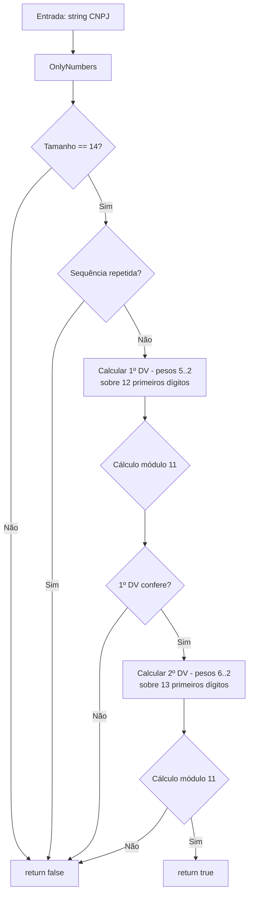

# tec-req-0002 — CNPJ — Validação (Especificação Técnica)

## Metadados

> **Nota:** Esta seção é uma reflexão do frontmatter YAML (bloco `---` no topo do arquivo) para leitura humana. O frontmatter é a fonte primária; qualquer divergência entre os dois deve ser resolvida atualizando o frontmatter primeiro.

- **Código do documento:** `tec-req-0002`
- **Título:** CNPJ — Validação — Especificação Técnica
- **Data de criação:** 27/07/2026
- **Última atualização:** 31/07/2026
- **Autor:** Rodrigo Araujo Barbosa
- **Versão:** 1.1.0
- **Status:** Aprovado
- **Requisito de negócio relacionado:** `req-0002-cnpj-validacao.md` (v1.1.0)

## 1. Resumo do requisito de negócio

Validar sintaticamente CNPJ (14 dígitos, módulo 11 com pesos específicos). Formatação (máscara) `00.000.000/0000-00` é coberta pelo `tec-req-0015`.

## 2. Detalhamento técnico

### Camadas

```
Extensions → CnpjExtension.cs (IsCnpjValid)
Validation → CnpjValidation.cs (IsValid)
Rules → CnpjRule.cs (internal) — CalculateBeforeLastDigitWeight, CalculateLastDigitWeight, CalculateDigitValue
```

### Algoritmo de validação

**1º dígito verificador (13ª posição):** pesos 5,4,3,2,9,8,7,6,5,4,3,2 sobre 12 primeiros dígitos
**2º dígito verificador (14ª posição):** pesos 6,5,4,3,2,9,8,7,6,5,4,3,2 sobre 13 primeiros dígitos

`CalculateBeforeLastDigitWeight(index)`: se index < 4 retorna 5 - index, senão 13 - index
`CalculateLastDigitWeight(index)`: se index < 5 retorna 6 - index, senão 14 - index

### Validações de entrada

- String vazia/nula → `false`
- Tamanho ≠ 14 → `false`
- Sequências repetidas → `false`
- Caracteres não numéricos são removidos automaticamente via `OnlyNumbers()` (normalização de entrada)

## 3. RFs e RNs

| ID | Descrição | Prioridade | RN |
| -- | --------- | ---------- | -- |
| RF-001 | Validar CNPJ com módulo 11 e pesos específicos (12+13 dígitos) | Alta | RN-001, RN-002 |
| RF-002 | Rejeitar sequências repetidas | Alta | RN-003 |
| RF-003 | Tratar entradas nulas/vazias → false | Alta | RN-003 |

## 4. Diagrama de fluxo



## 5. Exemplos

```csharp
// Validação
bool v1 = "12.345.678/0001-95".IsCnpjValid();      // true
bool v2 = "12345678000195".IsCnpjValid();            // true
bool i1 = "11111111111111".IsCnpjValid();            // false
bool i2 = "".IsCnpjValid();                           // false
```

## 6. Rastreabilidade

| Item | Referência |
| ---- | ---------- |
| Requisito de negócio | `req-0002-cnpj-validacao.md` |
| Requisito de máscara (formatação) | `tec-req-0015-cnpj-mascara.md` |
| Classe validação | `Documents/BR/Validation/CnpjValidation.cs` |
| Regras | `Documents/BR/Rules/CnpjRule.cs` |
| Extension | `Extensions/CnpjExtension.cs` |

## 7. Histórico

| Data | Autor | Versão | Alteração |
| ---- | ----- | ------ | --------- |
| 27/07/2026 | Rodrigo Araujo Barbosa | 1.0.0 | Criação |
| 31/07/2026 | Rodrigo Araujo Barbosa | 1.1.0 | Remoção do conteúdo de máscara (formatação transferida para tec-req-0015); RF/RN renumerados; OnlyNumbers no fluxo |

## 8. Clarification Log

| Data | Pergunta | Resposta | Status | Origem | Impacto |
| ---- | -------- | -------- | ------ | ------ | ------- |
| 27/07/2026 | Pesos do CNPJ estão em CnpjRule? | Sim, em CalculateBeforeLastDigitWeight e CalculateLastDigitWeight. | Resolvido | Criação | Confirma algoritmo. |

### Cobertura 8/8

| # | Área | Status | Justificativa |
| - | ---- | ------ | ------------- |
| 1 | Atores | Resolvido | Desenvolvedor .NET |
| 2 | Fluxos | Resolvido | Happy path + falha |
| 3 | Exceções | Resolvido | Entrada inválida retorna false |
| 4 | Integrações | N/A | Stateless |
| 5 | NFRs | Resolvido | p95 < 1ms |
| 6 | Dados | Resolvido | CNPJ sensível |
| 7 | Regras | Resolvido | RN-001 a RN-003 |
| 8 | Critérios | Resolvido | Gherkin + NFRs |
