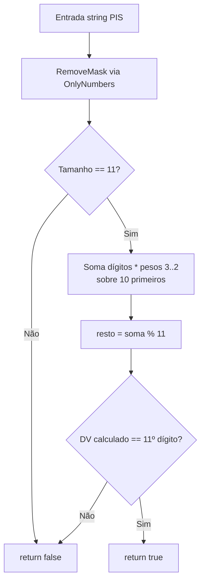

# tec-req-0003 — PIS — Validação (Especificação Técnica)

## Metadados

> **Nota:** Esta seção é uma reflexão do frontmatter YAML (bloco `---` no topo do arquivo) para leitura humana. O frontmatter é a fonte primária; qualquer divergência entre os dois deve ser resolvida atualizando o frontmatter primeiro.

- **Código do documento:** `tec-req-0003`
- **Título:** PIS — Validação — Especificação Técnica
- **Data de criação:** 27/07/2026
- **Última atualização:** 31/07/2026
- **Autor:** Rodrigo Araujo Barbosa
- **Versão:** 1.1.0
- **Status:** Aprovado
- **Requisito de negócio relacionado:** req-0003-pis-validacao.md (v1.1.0)

## 1. Resumo

Validar sintaticamente PIS (11 dígitos, módulo 11 com pesos específicos). Formatação (máscara) `000.00000.00-0` é coberta pelo `tec-req-0016`.

## 2. Detalhamento técnico

### Camadas
```
Extensions → PisExtension.cs (namespace Sirb.Validation.Extensions)
  └── IsPisValid(this string) → bool

Validation → PisValidation.cs
  ├── IsValid(string) → bool
  └── RemoveMask(string) → string (OnlyNumbers, normalização de entrada)

Rules → PisRule.cs (internal)
  ├── CalculateWeight(int index) → int
  └── CalculateLastDigit(int summation) → int
```

### Algoritmo
- Pesos: index=0→3, 1→2, 2→9, 3→8, 4→7, 5→6, 6→5, 7→4, 8→3, 9→2
- Soma += dígito * peso[i] para 10 primeiros dígitos
- resto = soma % 11
- DV = resto < 2 ? 0 : 11 - resto
- Comparar DV com 11º dígito da string original

## 3. Diagrama



## 4. Exemplos

```csharp
bool v = "123.45678.90-1".IsPisValid();   // true
bool v2 = "12345678901".IsPisValid();     // true
bool i = "12345678900".IsPisValid();      // false
bool i2 = "".IsPisValid();                // false
```

## 5. Rastreabilidade

| Item | Arquivo |
| ---- | ------- |
| Requisito de negócio | `req-0003-pis-validacao.md` |
| Requisito de máscara (formatação) | `tec-req-0016-pis-mascara.md` |
| Validation | `Documents/BR/Validation/PisValidation.cs` |
| Rules | `Documents/BR/Rules/PisRule.cs` |
| Extension | `Extensions/PisExtension.cs` |

## 6. Histórico

| Data | Autor | Versão | Alteração |
| ---- | ----- | ------ | --------- |
| 27/07/2026 | Rodrigo Araujo Barbosa | 1.0.0 | Criação |
| 31/07/2026 | Rodrigo Araujo Barbosa | 1.1.0 | Remoção do conteúdo de máscara (formatação transferida para tec-req-0016); RF/RN renumerados; OnlyNumbers no fluxo |
