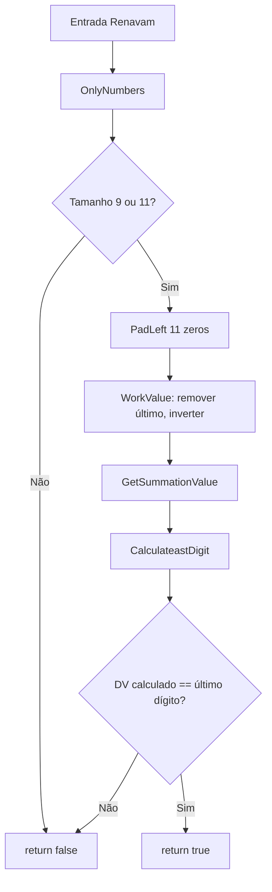

# tec-req-0005 — Renavam — Validação (Especificação Técnica)

## Metadados

> **Nota:** Esta seção é uma reflexão do frontmatter YAML (bloco `---` no topo do arquivo) para leitura humana. O frontmatter é a fonte primária; qualquer divergência entre os dois deve ser resolvida atualizando o frontmatter primeiro.

- **Código do documento:** `tec-req-0005`
- **Título:** Renavam — Validação — Especificação Técnica
- **Data de criação:** 27/07/2026
- **Última atualização:** 31/07/2026
- **Autor:** Rodrigo Araujo Barbosa
- **Versão:** 1.1.0
- **Status:** Aprovado

## 1. Resumo

Validar Renavam (9 ou 11 dígitos, módulo 11 com pesos 2..9). Renavam **não possui máscara**.

## 2. Detalhamento técnico

### Camadas
```
Validation:
  ├── RenavamValidation.cs — IsValid, OnlyNumbers (normalização de entrada)
  └── RenavamExtension.cs — IsRenavamValid(this string) → bool

Rules:
  └── RenavanRules.cs — GetSummationValue, CalculateastDigit
```

### Algoritmo
1. OnlyNumbers (normalização de entrada)
2. Tamanho 9 ou 11? senão false
3. Normalizar para 11 (left-pad com '0')
4. Remover último dígito, reverter string: WorkValue
5. Soma: workValue[8]*2 + workValue[9]*3 + workValue[0..7] × (2..9)
6. DV = 11 - (soma % 11); se ≥ 10, DV = 0
7. Comparar com último dígito original

## 3. Diagrama



## 4. Exemplos

```csharp
bool v = "12345678901".IsRenavamValid();  // true/false depende do DV
bool i = "".IsRenavamValid();              // false
```

## 5. Rastreabilidade

| Item | Arquivo |
| ---- | ------- |
| Validation | `Documents/BR/Validation/RenavamValidation.cs` |
| Extension | `Documents/BR/Validation/RenavamExtension.cs` |
| Rules | `Documents/BR/Rules/RenavanRules.cs` |

## 6. Histórico

| Data | Autor | Versão | Alteração |
| ---- | ----- | ------ | --------- |
| 27/07/2026 | Rodrigo Araujo Barbosa | 1.0.0 | Criação |
| 31/07/2026 | Rodrigo Araujo Barbosa | 1.1.0 | Alinhamento da nomenclatura de normalização (RemoveMask → OnlyNumbers); sem mudança de escopo |
