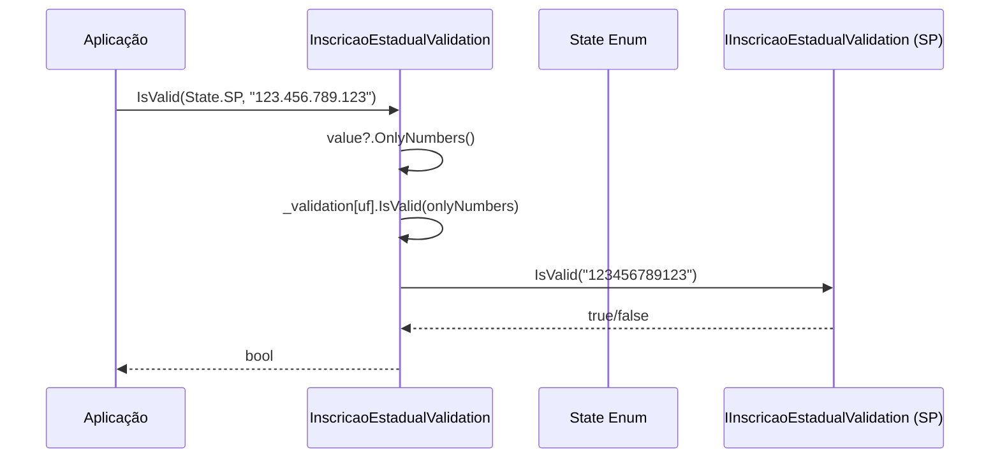

# tec-req-0006 — Inscrição Estadual — Validação e Máscara (Especificação Técnica)

## Metadados

> **Nota:** Esta seção é uma reflexão do frontmatter YAML (bloco `---` no topo do arquivo) para leitura humana. O frontmatter é a fonte primária; qualquer divergência entre os dois deve ser resolvida atualizando o frontmatter primeiro.

- **Código do documento:** `tec-req-0006`
- **Título:** Inscrição Estadual — Validação e Máscara — Especificação Técnica
- **Data de criação:** 27/07/2026
- **Última atualização:** 27/07/2026
- **Autor:** Rodrigo Araujo Barbosa
- **Versão:** 1.0.0
- **Status:** Aprovado
- **Requisito de negócio relacionado:** req-0006-inscricao-estadual-validacao-mascara.md

## 1. Resumo

Validar Inscrição Estadual de qualquer UF utilizando algoritmo específico por estado, com roteamento via enum `State`. Aplicar máscara por estado.

## 2. Detalhamento técnico

### Arquitetura

```
InscricaoEstadualValidation (Facade estática)
  ├── IsValid(State uf, string value) → bool
  │   └── Roteia para _validation[uf].IsValid(value)
  ├── PlaceMask(State uf, string value) → string
  │   └── Roteia para _mask[uf].Invoke(value)
  └── RemoveMask(string value) → string (OnlyNumbers)

Dicionário _validation: Dictionary<State, IInscricaoEstadualValidation>
  ├── 27 entries (AC, AL, AM, AP, BA, CE, DF, ES, GO, MA, MG, MS, MT,
  │               PA, PB, PE, PI, PR, RJ, RN, RO, RR, RS, SC, SE, SP, TO)
  └── Cada entry: new InscricaoEstadualXxxValidation()

Dicionário _mask: Dictionary<State, Func<string, string>>
  ├── 27 entries, cada uma referenciando o extension method de máscara do estado
  └── Ex.: State.SP → SaoPauloExtension.InscricaoEstadualMaskSp
```

### Interface

```csharp
public interface IInscricaoEstadualValidation
{
    bool IsValid(string ieValue);
}
```

### Implementações por estado

27 classes em `Documents/BR/Validation/Ie/`, cada uma com algoritmo módulo 11 ou 9 específico daquele estado.

### Exceções

```csharp
// StateNotFoundException — lançada quando estado não está nos dicionários
// (embora todos os 27+1 estejam mapeados, o acesso por chave inexistente lança KeyNotFoundException)
public class StateNotFoundException : Exception
{
    public StateNotFoundException() : base("State not found") { }
    public StateNotFoundException(string message) : base(message) { }
}
```

## 3. Diagrama de sequência



## 4. Exemplos

```csharp
using Sirb.Validation.Documents.BR.Enumeration;
using Sirb.Validation.Documents.BR.Validation;

// Validação
bool ieSP = InscricaoEstadualValidation.IsValid(State.SP, "123.456.789.123");
bool ieRJ = InscricaoEstadualValidation.IsValid(State.RJ, "12.345.67-8");

// Máscara
string mascaraSP = InscricaoEstadualValidation.PlaceMask(State.SP, "123456789123");
string mascaraBA = InscricaoEstadualValidation.PlaceMask(State.BA, "123456789");

// Remover máscara
string apenasDigitos = InscricaoEstadualValidation.RemoveMask("12.345.678-9");
```

## 5. Rastreabilidade

| Item | Caminho |
| ---- | ------- |
| Facade | `Documents/BR/Validation/InscricaoEstadualValidation.cs` |
| Interface | `Documents/BR/Interfaces/IInscricaoEstadualValidation.cs` |
| Validações por estado | `Documents/BR/Validation/Ie/InscricaoEstadualXxxValidation.cs` (27 arquivos) |
| Enum State | `Documents/BR/Enumeration/State.cs` |
| Extensions de máscara | `Extensions/XxxExtension.cs` (27 arquivos) |
| Exceção | `Exceptions/StateNotFoundException.cs` |

## 6. Histórico

| Data | Autor | Versão | Alteração |
| ---- | ----- | ------ | --------- |
| 27/07/2026 | Rodrigo Araujo Barbosa | 1.0.0 | Criação |
