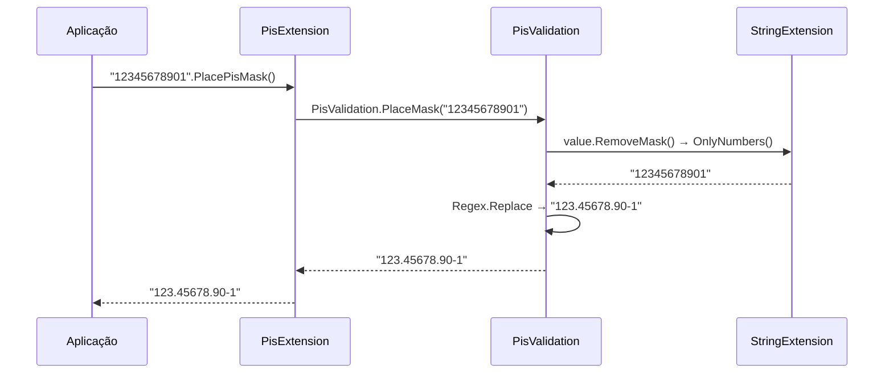

# tec-req-0016 — PIS — Máscara (Especificação Técnica)

## Metadados

> Esta tabela é uma **reflexão** do frontmatter YAML (bloco `---` no topo do arquivo) para leitura humana. O frontmatter é a fonte primária; qualquer divergência entre os dois deve ser resolvida atualizando o frontmatter primeiro.

| Campo | Valor |
|---|---|
| **Código do documento** | `tec-req-0016` |
| **Título** | PIS — Máscara — Especificação Técnica |
| **Versão** | 1.1.0 |
| **Autor** | Rodrigo Araujo Barbosa |
| **Data de criação** | 31/07/2026 |
| **Última atualização** | 31/07/2026 |
| **Status** | Aprovado |
| **Bundle** | `flat` |
| **Requisito de negócio** | `req-0016-pis-mascara.md` |
| **Cobertura Clarification** | 8/8 |
| **Tipo OKF** | `tec-req` |

## 1. Resumo do requisito de negócio

- **Requisito de origem:** `req-0016-pis-mascara.md` (versão 1.0.0)
- **Síntese do "o quê":** Aplicar máscara `000.00000.00-0` a strings contendo PIS/PASEP, com normalização prévia (remoção de não-dígitos) e tratamento de bordas (null/vazio → null).
- **Síntese do "por quê":** Padronizar formatação de PIS em aplicações .NET, garantindo conformidade com layout oficial da Caixa/Dataprev.

## 2. Detalhamento técnico completo

### 2.1 Arquitetura de camadas

```
Extensions (API Pública)
  └── PisExtension.cs                    (PlacePisMask via extension method)
Validation (Orquestração)
  └── PisValidation.cs                   (PlaceMask, RemoveMask → OnlyNumbers)
Extensions (Utilitários)
  └── StringExtension.cs                 (OnlyNumbers — regex [^\d])
```

### 2.2 Algoritmo de máscara

**Formato:** `000.00000.00-0`

**Regex:** `(\d{3})(\d{5})(\d{2})(\d{1})` → substituição `$1.$2.$3/$4`

**Fluxo:**
1. Verifica se entrada é null, vazia ou whitespace → retorna `default` (null)
2. Chama `RemoveMask(value)` → delega para `value.OnlyNumbers()` → regex `[^\d]`
3. Aplica `Regex.Replace` com padrão acima
4. Retorna string formatada

### 2.3 Validações de entrada

| Entrada | Comportamento |
|---------|---------------|
| `null` | Retorna `null` |
| `""` (vazio) | Retorna `null` |
| `"   "` (whitespace) | Retorna `null` (Trim + IsNullOrEmpty) |
| `"12345678901"` (11 dígitos) | Retorna `"123.45678.90-1"` |
| `"123.45678.90-1"` (já formatado) | Retorna `"123.45678.90-1"` (idempotente) |
| `"12a3.45b67c8.9d0-1"` (com letras) | Retorna `"123.45678.90-1"` (normaliza) |
| `"1234567890"` (10 dígitos) | Retorna `"1234567890"` (regex não casa, normalizado) |

**Nota:** O método **não valida** o PIS (dígito verificador). Apenas formata. Validação é `IsValid` (`req-0003`).

### 2.4 Normalização (RemoveMask)

- Método próprio em `PisValidation.RemoveMask(string value)` → delega para `value.OnlyNumbers()`
- `OnlyNumbers()` em `StringExtension`: `Regex.Replace(value, "[^\\d]", "")`
- Remove: pontos, traços, barras, espaços, letras, quaisquer não-dígitos

### 2.5 Namespace e localização

| Componente | Namespace | Arquivo |
|------------|-----------|---------|
| `PisValidation.PlaceMask` / `RemoveMask` | `Sirb.Validation.Documents.BR.Validation` | `Documents/BR/Validation/PisValidation.cs` |
| `PisExtension.PlacePisMask` | `Sirb.Validation.Extensions` | `Extensions/PisExtension.cs` |
| `StringExtension.OnlyNumbers` / `RemoveMask` | `Sirb.Validation.Extensions` | `Extensions/StringExtension.cs` |

**Nota:** `PisExtension` está corretamente em `Sirb.Validation.Extensions` (diferente de CPF/CNPJ que estão em `Exceptions`).

## 3. Regras funcionais e regras de negócio numeradas

### Regras funcionais (RF)

| ID | Descrição | Prioridade | Regra de negócio associada |
| -- | --------- | ---------- | -------------------------- |
| RF-001 | Aplicar máscara `000.00000.00-0` via regex em string normalizada (apenas dígitos) | Alta | RN-001 |
| RF-002 | Normalizar entrada removendo todos caracteres não numéricos antes da máscara | Alta | RN-002 |
| RF-003 | Retornar `null` para entrada null, vazia ou apenas whitespace | Alta | RN-003 |
| RF-004 | Expor como extension method `PlacePisMask()` sobre `string` | Alta | RN-004 |

### Regras de negócio (RN)

| ID | Regra | Origem | Impacto |
| -- | ----- | ------ | ------- |
| RN-001 | Máscara PIS: padrão `000.00000.00-0`, regex `(\d{3})(\d{5})(\d{2})(\d{1})` → `$1.$2.$3/$4` | Padrão oficial (Caixa/Dataprev) | Formatação |
| RN-002 | Normalização: `RemoveMask()` = `OnlyNumbers()` = regex `[^\d]` remove não-dígitos | Boa prática / Código existente | Normalização |
| RN-003 | Entrada null/vazia/whitespace → `null` (não string vazia) | Comportamento atual | Tratamento de borda |
| RN-004 | API pública: extension method em `PisExtension` (namespace `Sirb.Validation.Extensions`) | Design da biblioteca | Descoberta IntelliSense |

## 4. Diagramas técnicos

### 4.1 Diagrama de fluxo — Aplicação de máscara PIS

```mermaid
flowchart TD
    A[Entrada: string value] --> B{string.IsNullOrEmpty(value?.Trim())?}
    B -->|Sim| C[return default (null)]
    B -->|Não| D[normalized = RemoveMask(value)]
    D --> E[Regex.Replace(normalized, '(\d{3})(\d{5})(\d{2})(\d{1})', '$1.$2.$3/$4')]
    E --> F[return formatted]
```

### 4.2 Diagrama de sequência



## 5. Exemplos técnicos

### 5.1 Exemplos de código C#

```csharp
using Sirb.Validation.Extensions;
using Sirb.Validation.Documents.BR.Validation;

// --- Extension method (API pública) ---
string mascarado1 = "12345678901".PlacePisMask();           // "123.45678.90-1"
string mascarado2 = "123.45678.90-1".PlacePisMask();        // "123.45678.90-1" (idempotente)
string mascarado3 = "12a3.45b67c8.9d0-1".PlacePisMask();    // "123.45678.90-1" (normaliza)
string nulo1 = "".PlacePisMask();                           // null
string nulo2 = ((string)null).PlacePisMask();               // null
string nulo3 = "   ".PlacePisMask();                        // null

// --- Método interno (camada de validação) ---
string mascarado4 = PisValidation.PlaceMask("12345678901"); // "123.45678.90-1"

// --- Normalização direta ---
string apenasDigitos = "123.45678.90-1".RemoveMask();       // "12345678901"
string apenasDigitos2 = "abc123def".OnlyNumbers();          // "123"
```

### 5.2 Cenários de borda e exceções

| Cenário | Entrada | Resultado | Motivo |
| ------- | ------- | --------- | ------ |
| PIS 10 dígitos | `"1234567890"` | `"1234567890"` | Regex não casa (precisa 11), retorna normalizado |
| PIS 12 dígitos | `"123456789012"` | `"123456789012"` | Regex não casa, retorna normalizado |
| Apenas letras | `"abcdefghijk"` | `""` (vazio) | OnlyNumbers remove tudo, regex não casa em string vazia |
| Caracteres especiais | `"!@#$%^&*()"` | `""` (vazio) | OnlyNumbers remove tudo |

## 6. Rastreabilidade

| Item | Referência |
| ---- | ---------- |
| Requisito de negócio | `req-0016-pis-mascara.md` |
| Requisito de validação base | `req-0003-pis-validacao.md` |
| Classe de validação | `Sirb.Validation/Documents/BR/Validation/PisValidation.cs` (linhas 52-65) |
| Regras de cálculo (não usadas aqui) | `Sirb.Validation/Documents/BR/Rules/PisRule.cs` |
| Extension method API pública | `Sirb.Validation/Extensions/PisExtension.cs` (linhas 1-19) |
| Utilitário de normalização | `Sirb.Validation/Extensions/StringExtension.cs` (`OnlyNumbers`, `RemoveMask`) |
| Testes | `Sirb.Validation.Test/Extensions/PisExtensionTest.cs` (método `PlaceMask`) |
| Mockup (geração) | `Sirb.Validation/Documents/BR/Mockups/Pis.cs` (req-0009) |

## 7. Validações realizadas para esta documentação

- [x] `README.md` do projeto analisado
- [x] `req-0016` correspondente lido e referenciado
- [x] Código-fonte analisado: `PisValidation.cs`, `PisExtension.cs`, `StringExtension.cs`
- [x] Diagramas Mermaid validados (sintaxe)
- [x] Documentações correlatas revisadas (`constituicao.md`, `architecture-tech-stack.md`, `req-0003`)
- [x] Matriz global de risco do sistema atualizada (`system-risk-matrix.md`)
- [x] APF do requisito criado (`apf-req-0016.md`)
- [x] Clarification Log preenchido e sincronizado com o `req-0016` correspondente
- [x] Nenhum item Pendente no Clarification Log que impacte aceite/escopo
- [x] Frontmatter YAML validado: `type` preenchido, `domain.version` incrementado, `domain.author` é nome de usuário
- [x] Tabela `## Metadados` reflete os valores do frontmatter YAML

## 8. Histórico de alterações e Clarification Log

### 8.1 Histórico de alterações

| Data | Autor | Versão | Alteração |
| ---- | ----- | ------ | --------- |
| 31/07/2026 | Rodrigo Araujo Barbosa | 1.0.0 | Criação do documento |
| 31/07/2026 | Rodrigo Araujo Barbosa | 1.1.0 | Atualização de referência ao requisito base renomeado (`req-0003-pis-validacao.md`) |

### 8.2 Clarification Log

| Data | Pergunta | Resposta | Status | Origem | Impacto |
| ---- | -------- | -------- | ------ | ------ | ------- |
| 31/07/2026 | O PlaceMask deve validar o PIS antes de mascarar? | Não. Apenas formata. Validação é IsValid (req-0003). | Resolvido | Criação | Define escopo: máscara pura. |
| 31/07/2026 | Qual o comportamento para string com menos de 11 dígitos? | Regex não casa, retorna string normalizada sem máscara. | Resolvido | Criação | Cenário de borda. |
| 31/07/2026 | PlacePisMask está em namespace Extensions? | Sim, `Sirb.Validation.Extensions` (correto). | Resolvido | Criação | Consistência confirmada. |
| 31/07/2026 | O método deve lançar exceção para entrada inválida? | Não. Retorna null para vazio/nulo; outros aplicam regex. | Resolvido | Criação | Comportamento defensivo. |
| 31/07/2026 | Existe método RemoveMask específico para PIS? | Sim, `PisValidation.RemoveMask()` delega para `OnlyNumbers()`. | Resolvido | Criação | Método próprio na validação. |
| 31/07/2026 | A máscara deve preservar caracteres não numéricos? | Não. Remove todos não-dígitos antes de formatar. | Resolvido | Criação | Normalização. |
| 31/07/2026 | Qual a diferença entre PlaceMask e PlacePisMask? | PlaceMask interno em PisValidation; PlacePisMask extension público. | Resolvido | Criação | Arquitetura de camadas. |
| 31/07/2026 | O código atual trata whitespace-only como vazio? | Sim. `value?.Trim()` + `string.IsNullOrEmpty`. | Resolvido | Criação | Comportamento confirmado. |

### Cobertura do Clarification (8 áreas)

| # | Área | Status | Ref. entrada no Log | Justificativa (se N/A) |
| - | ---- | ------ | ------------------- | ---------------------- |
| 1 | Atores e personas | Resolvido | Desenvolvedor .NET consumidor | — |
| 2 | Fluxos principais e alternativos | Resolvido | Cenários Gherkin | — |
| 3 | Exceções e erros | Resolvido | Entrada inválida retorna null | — |
| 4 | Integrações externas | Resolvido | N/A — sem dependências | Stateless |
| 5 | Requisitos não-funcionais | Resolvido | p95 < 1ms, ReDoS, API fluente | — |
| 6 | Dados e privacidade | Resolvido | PIS sensível; não logar bruto | — |
| 7 | Validações e regras de negócio | Resolvido | RN-001 a RN-004 | — |
| 8 | Critérios de aceite e mensurabilidade | Resolvido | Gherkin + NFRs métricas | — |

**Cobertura atual:** 8/8. **Meta:** 8/8 (OK).