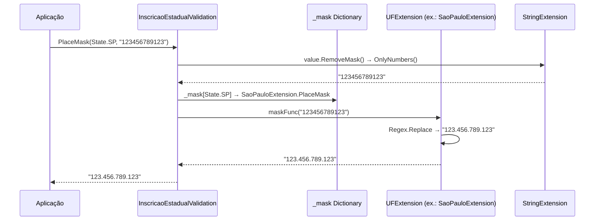
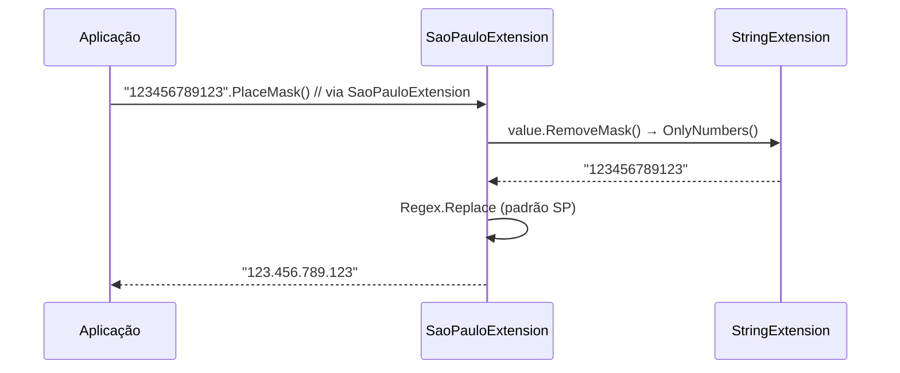

# tec-req-0018 — Inscrição Estadual (27 UFs + DF) — Máscaras (Especificação Técnica)

## Metadados

> Esta tabela é uma **reflexão** do frontmatter YAML (bloco `---` no topo do arquivo) para leitura humana. O frontmatter é a fonte primária; qualquer divergência entre os dois deve ser resolvida atualizando o frontmatter primeiro.

| Campo | Valor |
|---|---|
| **Código do documento** | `tec-req-0018` |
| **Título** | Inscrição Estadual (27 UFs + DF) — Máscaras — Especificação Técnica |
| **Versão** | 1.1.0 |
| **Autor** | Rodrigo Araujo Barbosa |
| **Data de criação** | 31/07/2026 |
| **Última atualização** | 31/07/2026 |
| **Status** | Aprovado |
| **Bundle** | `flat` |
| **Requisito de negócio** | `req-0018-inscricao-estadual-mascara.md` |
| **Cobertura Clarification** | 8/8 |
| **Tipo OKF** | `tec-req` |

## 1. Resumo do requisito de negócio

- **Requisito de origem:** `req-0018-inscricao-estadual-mascara.md` (versão 1.0.0)
- **Síntese do "o quê":** Aplicar máscara específica de IE por UF (27 estados + DF) via roteamento central (`InscricaoEstadualValidation.PlaceMask(State, value)`) ou extension methods estaduais, com normalização prévia (remoção de não-dígitos) e tratamento de bordas (null/vazio → null, UF inválida → StateNotFoundException).
- **Síntese do "por quê":** Centralizar as 28 máscaras estaduais em um ponto único, garantindo conformidade com cada legislação estadual (Sefaz) para emissão de NF-e e obrigações acessórias.

## 2. Detalhamento técnico completo

### 2.1 Arquitetura de camadas

```
Extensions (API Pública - Estadual)
  ├── AcreExtension.cs ... TocantinsExtension.cs   (27 classes, cada uma com PlaceMask(string))
  └── StateExtension.cs                            (PlaceMask(this string, State) — roteamento genérico)

Validation (Orquestração Central)
  └── InscricaoEstadualValidation.cs               (PlaceMask(State, string), dicionário _mask)

Extensions (Utilitários)
  └── StringExtension.cs                           (OnlyNumbers — regex [^\d])

Enumeration
  └── State.cs                                     (enum com 27 valores + DF)

Interfaces
  └── IInscricaoEstadualValidation.cs              (contrato IsValid, PlaceMask)
  └── IInscricaoEstadualInternal.cs                (contrato interno)
```

### 2.2 Roteamento central — `InscricaoEstadualValidation.PlaceMask`

**Método:**
```csharp
public static string PlaceMask(State state, string value)
{
    if (string.IsNullOrEmpty(value?.Trim()))
        return default;

    if (!_mask.TryGetValue(state, out var maskFunc))
        throw new StateNotFoundException(state);

    return maskFunc(value.RemoveMask());
}
```

**Dicionário `_mask` (estático, inicializado uma vez):**
```csharp
private static readonly Dictionary<State, Func<string, string>> _mask = new()
{
    { State.AC, AcreExtension.PlaceMask },
    { State.AL, AlagoasExtension.PlaceMask },
    { State.AP, AmapaExtension.PlaceMask },
    { State.AM, AmazonasExtension.PlaceMask },
    { State.BA, BahiaExtension.PlaceMask },
    { State.CE, CearaExtension.PlaceMask },
    { State.DF, DistritoFederalExtension.PlaceMask },
    { State.ES, EspiritoSantoExtension.PlaceMask },
    { State.GO, GoiasExtension.PlaceMask },
    { State.MA, MaranhaoExtension.PlaceMask },
    { State.MT, MatoGrossoExtension.PlaceMask },
    { State.MS, MatoGrossoDoSulExtension.PlaceMask },
    { State.MG, MinasGeraisExtension.PlaceMask },
    { State.PA, ParaExtension.PlaceMask },
    { State.PB, ParaibaExtension.PlaceMask },
    { State.PR, ParanaExtension.PlaceMask },
    { State.PE, PernambucoExtension.PlaceMask },
    { State.PI, PiauiExtension.PlaceMask },
    { State.RJ, RioDeJaneiroExtension.PlaceMask },
    { State.RN, RioGrandeDoNorteExtension.PlaceMask },
    { State.RS, RioGrandeDoSulExtension.PlaceMask },
    { State.RO, RondoniaExtension.PlaceMask },
    { State.RR, RoraimaExtension.PlaceMask },
    { State.SC, SantaCatarinaExtension.PlaceMask },
    { State.SP, SaoPauloExtension.PlaceMask },
    { State.SE, SergipeExtension.PlaceMask },
    { State.TO, TocantinsExtension.PlaceMask },
};
```

### 2.3 Extension methods estaduais (exemplo: SP)

```csharp
// Sirb.Validation.Extensions.SaoPauloExtension
public static class SaoPauloExtension
{
    public static string PlaceMask(this string value)
    {
        if (string.IsNullOrEmpty(value?.Trim()))
            return default;

        return Regex.Replace(value.RemoveMask(), @"(\d{3})(\d{3})(\d{3})(\d{3})", "$1.$2.$3.$4");
    }
}
```

Cada UF tem sua própria regex e formato (exemplos):
| UF | Formato | Regex (grupos) | Exemplo |
|----|---------|----------------|---------|
| SP | `000.000.000.123` | `(\d{3})(\d{3})(\d{3})(\d{3})` | `123.456.789.123` |
| MG | `000.000.000/0000` | `(\d{3})(\d{3})(\d{3})(\d{4})` | `123.456.789/0123` |
| RJ | `00.000.000-0` | `(\d{2})(\d{3})(\d{3})(\d{1})` | `12.345.678-9` |
| RS | `000/0000000` | `(\d{3})(\d{7})` | `123/4567890` |
| ... | ... | ... | ... |

**Nota:** Os formatos exatos por UF devem ser consultados na documentação oficial de cada Sefaz estadual. O código atual implementa os padrões conhecidos.

### 2.4 Normalização (RemoveMask)

- Delegado para `StringExtension.OnlyNumbers()`: `Regex.Replace(value, "[^\\d]", "")`
- Remove: pontos, traços, barras, espaços, letras, quaisquer não-dígitos
- Aplicado **antes** da máscara específica da UF

### 2.5 Validações de entrada

| Entrada | Comportamento |
|---------|---------------|
| `null` / `""` / `"   "` | Retorna `null` (default) |
| UF válida,  dígitos corretos | Retorna string formatada no padrão da UF |
| UF válida, dígitos insuficientes | Regex não casa → retorna normalizado sem máscara |
| UF inválida (fora do enum) | Lança `StateNotFoundException` |
| Com letras/caracteres especiais | Normaliza (remove não-dígitos) → aplica máscara da UF |

### 2.6 Namespace e localização

| Componente | Namespace | Arquivo |
|------------|-----------|---------|
| `InscricaoEstadualValidation.PlaceMask` | `Sirb.Validation.Documents.BR.Validation` | `Documents/BR/Validation/InscricaoEstadualValidation.cs` |
| `AcreExtension.PlaceMask` ... `TocantinsExtension.PlaceMask` | `Sirb.Validation.Extensions` | `Extensions/AcreExtension.cs` ... `TocantinsExtension.cs` |
| `StateExtension.PlaceMask(this string, State)` | `Sirb.Validation.Extensions` | `Extensions/StateExtension.cs` |
| `StringExtension.OnlyNumbers` / `RemoveMask` | `Sirb.Validation.Extensions` | `Extensions/StringExtension.cs` |
| `State` enum | `Sirb.Validation.Documents.BR.Enumeration` | `Documents/BR/Enumeration/State.cs` |
| `StateNotFoundException` | `Sirb.Validation.Exceptions` | `Exceptions/StateNotFoundException.cs` |

## 3. Regras funcionais e regras de negócio numeradas

### Regras funcionais (RF)

| ID | Descrição | Prioridade | Regra de negócio associada |
| -- | --------- | ---------- | -------------------------- |
| RF-001 | Aplicar máscara específica da UF via roteamento central `PlaceMask(State, value)` | Alta | RN-001, RN-006 |
| RF-002 | Normalizar entrada removendo todos caracteres não numéricos antes da máscara | Alta | RN-002 |
| RF-003 | Retornar `null` para entrada null, vazia ou apenas whitespace | Alta | RN-003 |
| RF-004 | Lançar `StateNotFoundException` para UF não suportada (fora do enum `State`) | Alta | RN-004 |
| RF-005 | Expor 27 extension methods estaduais (`UFExtension.PlaceMask(string)`) | Média | RN-005 |
| RF-006 | Expor extension method genérico `PlaceMask(this string, State)` via `StateExtension` | Média | RN-001, RN-006 |

### Regras de negócio (RN)

| ID | Regra | Origem | Impacto |
| -- | ----- | ------ | ------- |
| RN-001 | Cada UF tem máscara própria (regex/formato específicos). Roteamento via enum `State` (27 + DF). | Legislação estadual (Sefaz) | Formatação por UF |
| RN-002 | Normalização: `RemoveMask()` = `OnlyNumbers()` = regex `[^\d]` remove não-dígitos | Boa prática / Código existente | Normalização |
| RN-003 | Entrada null/vazia/whitespace → `null` | Comportamento atual | Tratamento de borda |
| RN-004 | UF inválida → `StateNotFoundException` | Design da biblioteca | Tratamento de erro |
| RN-005 | 27 classes de extension estaduais com `PlaceMask(string)` | Design da biblioteca | Descoberta IntelliSense por UF |
| RN-006 | Dicionário estático `_mask: Dictionary<State, Func<string,string>>` mapeia UF → função de máscara | Arquitetura atual | Roteamento O(1) performático |

## 4. Diagramas técnicos

### 4.1 Diagrama de fluxo — Roteamento de máscara IE

```mermaid
flowchart TD
    A[Entrada: State state, string value] --> B{string.IsNullOrEmpty(value?.Trim())?}
    B -->|Sim| C[return default (null)]
    B -->|Não| D[_mask.TryGetValue(state, out maskFunc)?]
    D -->|Não| E[throw StateNotFoundException(state)]
    D -->|Sim| F[normalized = value.RemoveMask()]
    F --> G[return maskFunc(normalized)]
```

### 4.2 Diagrama de sequência — Roteamento central



### 4.3 Diagrama de sequência — Extension method estadual direto



## 5. Exemplos técnicos

### 5.1 Exemplos de código C#

```csharp
using Sirb.Validation.Documents.BR.Validation;
using Sirb.Validation.Documents.BR.Enumeration;
using Sirb.Validation.Extensions;
using Sirb.Validation.Exceptions;

// --- Roteamento central (recomendado para UF dinâmica) ---
string mascaradoSP1 = InscricaoEstadualValidation.PlaceMask(State.SP, "123456789123");  // "123.456.789.123"
string mascaradoMG1 = InscricaoEstadualValidation.PlaceMask(State.MG, "1234567890123"); // "123.456.789/0123"
string mascaradoRJ1 = InscricaoEstadualValidation.PlaceMask(State.RJ, "123456789");     // "12.345.678-9"

// --- Extension method genérico por State ---
string mascaradoSP2 = "123456789123".PlaceMask(State.SP);  // via StateExtension

// --- Extension methods estaduais diretos (UF conhecida em compile-time) ---
string mascaradoSP3 = "123456789123".PlaceMask();  // via SaoPauloExtension
string mascaradoMG2 = "1234567890123".PlaceMask(); // via MinasGeraisExtension

// --- Tratamento de bordas ---
string nulo1 = InscricaoEstadualValidation.PlaceMask(State.SP, null);      // null
string nulo2 = InscricaoEstadualValidation.PlaceMask(State.SP, "");        // null
string nulo3 = InscricaoEstadualValidation.PlaceMask(State.SP, "   ");     // null

// --- UF inválida ---
try {
    var erro = InscricaoEstadualValidation.PlaceMask((State)999, "123"); // StateNotFoundException
} catch (StateNotFoundException ex) {
    // ex.State == (State)999
}

// --- Normalização com caracteres mistos ---
string normalizado = InscricaoEstadualValidation.PlaceMask(State.SP, "12a3.45b6.78c9.1d23"); // "123.456.789.123"
```

### 5.2 Cenários de borda e exceções

| Cenário | Entrada | Resultado | Motivo |
| ------- | ------- | --------- | ------ |
| UF inválida (fora do enum) | `PlaceMask((State)999, "123")` | `StateNotFoundException` | `_mask.TryGetValue` falha |
| IE com dígitos insuficientes para UF | `PlaceMask(State.SP, "12345")` | `"12345"` (sem máscara) | Regex SP precisa 12 dígitos, não casa |
| Apenas letras | `PlaceMask(State.SP, "abcdefghijkl")` | `""` (vazio) | OnlyNumbers remove tudo |
| Caracteres especiais | `PlaceMask(State.MG, "!@#$%^&*()")` | `""` (vazio) | OnlyNumbers remove tudo |

## 6. Rastreabilidade

| Item | Referência |
| ---- | ---------- |
| Requisito de negócio | `req-0018-inscricao-estadual-mascara.md` |
| Requisito de validação base | `req-0006-inscricao-estadual-validacao.md` |
| Classe de roteamento central | `Sirb.Validation/Documents/BR/Validation/InscricaoEstadualValidation.cs` |
| Extensions estaduais (27) | `Sirb.Validation/Extensions/AcreExtension.cs` ... `TocantinsExtension.cs` |
| Extension genérico State | `Sirb.Validation/Extensions/StateExtension.cs` |
| Enum de estados | `Sirb.Validation/Documents/BR/Enumeration/State.cs` |
| Exceção personalizada | `Sirb.Validation/Exceptions/StateNotFoundException.cs` |
| Interfaces | `Sirb.Validation/Documents/BR/Interfaces/IInscricaoEstadualValidation.cs` |
| Utilitário normalização | `Sirb.Validation/Extensions/StringExtension.cs` |
| Testes (27) | `Sirb.Validation.Test/Extensions/AcreExtensionTest.cs` ... `TocantinsExtensionTest.cs` |
| Mockups (geração, 27) | `Sirb.Validation/Documents/BR/Mockups/Ie/` (req-0012) |

## 7. Validações realizadas para esta documentação

- [x] `README.md` do projeto analisado
- [x] `req-0018` correspondente lido e referenciado
- [x] Código-fonte analisado: `InscricaoEstadualValidation.cs`, extensions estaduais, `State.cs`, `StateExtension.cs`
- [x] Diagramas Mermaid validados (sintaxe)
- [x] Documentações correlatas revisadas (`constituicao.md`, `architecture-tech-stack.md`, `req-0006`)
- [x] Matriz global de risco do sistema atualizada (`system-risk-matrix.md`)
- [x] APF do requisito criado (`apf-req-0018.md`)
- [x] Clarification Log preenchido e sincronizado com o `req-0018` correspondente
- [x] Nenhum item Pendente no Clarification Log que impacte aceite/escopo
- [x] Frontmatter YAML validado: `type` preenchido, `domain.version` incrementado, `domain.author` é nome de usuário
- [x] Tabela `## Metadados` reflete os valores do frontmatter YAML

## 8. Histórico de alterações e Clarification Log

### 8.1 Histórico de alterações

| Data | Autor | Versão | Alteração |
| ---- | ----- | ------ | --------- |
| 31/07/2026 | Rodrigo Araujo Barbosa | 1.0.0 | Criação do documento |
| 31/07/2026 | Rodrigo Araujo Barbosa | 1.1.0 | Atualização de referência ao requisito base renomeado (`req-0006-inscricao-estadual-validacao.md`) |

### 8.2 Clarification Log

| Data | Pergunta | Resposta | Status | Origem | Impacto |
| ---- | -------- | -------- | ------ | ------ | ------- |
| 31/07/2026 | O PlaceMask deve validar a IE antes de mascarar? | Não. Apenas formata. Validação é IsValid (req-0006). | Resolvido | Criação | Define escopo: máscara pura. |
| 31/07/2026 | Qual o comportamento para dígitos insuficientes para a UF? | Regex não casa, retorna string normalizada sem máscara. | Resolvido | Criação | Cenário de borda por UF. |
| 31/07/2026 | As extensions estaduais estão no namespace correto? | Sim, `Sirb.Validation.Extensions` (todas as 27). | Resolvido | Criação | Consistência confirmada. |
| 31/07/2026 | O método deve lançar exceção para entrada inválida? | Não para vazio/nulo (null); sim para UF inválida (StateNotFoundException). | Resolvido | Criação | Dois tipos de erro distintos. |
| 31/07/2026 | Existe método RemoveMask específico para IE? | Não. Usa `StringExtension.OnlyNumbers()` (regex `[^\d]`). | Resolvido | Criação | Reuso de utilitário global. |
| 31/07/2026 | Como é feito o roteamento por UF? | Dicionário estático `_mask: Dictionary<State, Func<string,string>>`. | Resolvido | Criação | O(1) lookup, performático. |
| 31/07/2026 | Quantas UFs têm máscara definida? | 27 estados + DF = 28 entries no dicionário `_mask`. | Resolvido | Criação | Cobertura completa. |
| 31/07/2026 | O código atual trata whitespace-only como vazio? | Sim. Verifica `string.IsNullOrEmpty(value?.Trim())` nas máscaras. | Resolvido | Criação | Comportamento consistente. |

### Cobertura do Clarification (8 áreas)

| # | Área | Status | Ref. entrada no Log | Justificativa (se N/A) |
| - | ---- | ------ | ------------------- | ---------------------- |
| 1 | Atores e personas | Resolvido | Desenvolvedor .NET de sistemas fiscais | — |
| 2 | Fluxos principais e alternativos | Resolvido | Cenários Gherkin (central + estadual) | — |
| 3 | Exceções e erros | Resolvido | Null para vazio; StateNotFoundException para UF inválida | — |
| 4 | Integrações externas | Resolvido | N/A — stateless | Justificativa: sem dependências |
| 5 | Requisitos não-funcionais | Resolvido | Performance, segurança, extensibilidade | — |
| 6 | Dados e privacidade | Resolvido | IE sensível; não logar bruta | — |
| 7 | Validações e regras de negócio | Resolvido | RN-001 a RN-006, 28 máscaras | — |
| 8 | Critérios de aceite e mensurabilidade | Resolvido | Gherkin + NFRs métricas | — |

**Cobertura atual:** 8/8. **Meta:** 8/8 (OK).