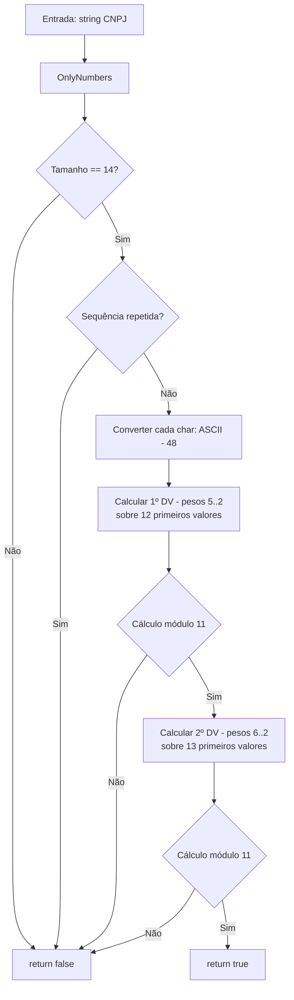

# tec-req-0019 — CNPJ Alfanumérico — Validação (Especificação Técnica)

## Metadados

> **Nota:** Esta seção é uma reflexão do frontmatter YAML (bloco `---` no topo do arquivo) para leitura humana. O frontmatter é a fonte primária; qualquer divergência entre os dois deve ser resolvida atualizando o frontmatter primeiro.

- **Código do documento:** `tec-req-0019`
- **Título:** CNPJ Alfanumérico — Validação — Especificação Técnica
- **Data de criação:** 31/07/2026
- **Última atualização:** 31/07/2026
- **Autor:** Rodrigo Araujo Barbosa
- **Versão:** 1.0.0
- **Status:** Rascunho
- **Requisito de negócio relacionado:** `req-0019-cnpj-alfanumerico-validacao.md` (v1.0.0)

## 1. Resumo do requisito de negócio

Validar sintaticamente CNPJ Alfanumérico (14 caracteres: 12 alfanuméricos + 2 dígitos verificadores numéricos), algoritmo módulo 11 com conversão ASCII-48. Formatação (máscara) `XX.XXX.XXX/XXXX-XX` é coberta por requisito separado. Retrocompatível com CNPJ numérico legado.

## 2. Detalhamento técnico

### Camadas

```
Extensions → CnpjAlfanumericoExtension.cs (IsCnpjAlfanumericoValid)
Validation → CnpjAlfanumericoValidation.cs (IsValid)
Rules → CnpjAlfanumericoRule.cs (internal) — CalculateWeight, CalculateDigitValue, CharToAsciiValue
```

### Algoritmo de validação

**Conversão de caractere (ASCII - 48):**
- Dígitos `'0'` a `'9'` (ASCII 48-57) → valores 0-9
- Letras `'A'` a `'Z'` (ASCII 65-90) → valores 17-42
- `CharToAsciiValue(char c)` → `(int)c - 48`

**1º dígito verificador (13ª posição):** pesos 5,4,3,2,9,8,7,6,5,4,3,2 sobre 12 primeiros caracteres
**2º dígito verificador (14ª posição):** pesos 6,5,4,3,2,9,8,7,6,5,4,3,2 sobre 13 primeiros caracteres

`CalculateBeforeLastDigitWeight(index)`: se index < 4 retorna 5 - index, senão 13 - index
`CalculateLastDigitWeight(index)`: se index < 5 retorna 6 - index, senão 14 - index

`CalculateDigitValue(summationValue)`: resto = summationValue % 11; se resto < 2 retorna 0; senão 11 - resto

### Validações de entrada

- String vazia/nula → `false`
- Tamanho ≠ 14 → `false`
- Sequências de caracteres repetidos → `false`
- Caracteres não alfanuméricos são removidos automaticamente via `OnlyNumbers()` (normalização de entrada)
- Apenas caracteres ASCII 0-9, A-Z são válidos nas 12 primeiras posições; 2 últimas devem ser dígitos 0-9

### Diferenças em relação ao CNPJ numérico (req-0002/tec-req-0002)

| Aspecto | CNPJ Numérico (req-0002) | CNPJ Alfanumérico (req-0019) |
| ------- | ------------------------ | ---------------------------- |
| Entrada | 14 dígitos (0-9) | 12 alfanuméricos (0-9, A-Z) + 2 dígitos (0-9) |
| Conversão | `int.Parse(char.ToString())` | `(int)char - 48` |
| Pesos 1º DV | 5,4,3,2,9,8,7,6,5,4,3,2 | Idênticos |
| Pesos 2º DV | 6,5,4,3,2,9,8,7,6,5,4,3,2 | Idênticos |
| Sequências repetidas | 00000000000000 a 99999999999999 | AAAAAAAAAAAAAA, BBBBBBBBBBBBBB, etc. |
| Retrocompatibilidade | N/A | Aceita CNPJ numérico (dígitos mantêm valor ASCII-48 = valor original) |

## 3. RFs e RNs

| ID | Descrição | Prioridade | RN |
| -- | --------- | ---------- | -- |
| RF-001 | Validar CNPJ Alfanumérico com módulo 11 e pesos específicos (conversão ASCII-48) | Alta | RN-001, RN-002 |
| RF-002 | Rejeitar sequências de caracteres repetidos | Alta | RN-003 |
| RF-003 | Tratar entradas nulas/vazias → false | Alta | RN-003 |
| RF-004 | Aceitar CNPJ numérico legado → true (retrocompatibilidade) | Alta | RN-004 |
| RF-005 | Normalizar entrada via OnlyNumbers antes da validação | Alta | RN-005 |

## 4. Diagrama de fluxo



## 5. Tabela de conversão ASCII-48 (referência)

| Caractere | ASCII | Valor DV (ASCII-48) |
| --------- | ----- | ------------------- |
| `0` | 48 | 0 |
| `1` | 49 | 1 |
| ... | ... | ... |
| `9` | 57 | 9 |
| `A` | 65 | 17 |
| `B` | 66 | 18 |
| `C` | 67 | 19 |
| ... | ... | ... |
| `Z` | 90 | 42 |

*Nota: A Receita Federal recomenda evitar I(73→25), O(79→31), Q(81→33), F(70→22) por confusão visual, mas a validação aceita todas A-Z.*

## 6. Exemplos

```csharp
// Validação CNPJ Alfanumérico
bool v1 = "12.ABC.345/01DE-35".IsCnpjAlfanumericoValid();  // true
bool v2 = "12ABC34501DE35".IsCnpjAlfanumericoValid();        // true

// Validação CNPJ numérico legado (retrocompatibilidade)
bool v3 = "12.345.678/0001-95".IsCnpjAlfanumericoValid();    // true
bool v4 = "12345678000195".IsCnpjAlfanumericoValid();         // true

// Inválidos
bool i1 = "AAAAAAAAAAAAAA".IsCnpjAlfanumericoValid();         // false (repetido)
bool i2 = "12ABC34501DE00".IsCnpjAlfanumericoValid();         // false (DV errado)
bool i3 = "".IsCnpjAlfanumericoValid();                        // false
bool i4 = "12ABC34501DE".IsCnpjAlfanumericoValid();           // false (tamanho)
```

## 7. Rastreabilidade

| Item | Referência |
| ---- | ---------- |
| Requisito de negócio | `req-0019-cnpj-alfanumerico-validacao.md` |
| Requisito CNPJ numérico | `tec-req-0002-cnpj-validacao.md` |
| Classe validação | `Documents/BR/Validation/CnpjAlfanumericoValidation.cs` |
| Regras | `Documents/BR/Rules/CnpjAlfanumericoRule.cs` |
| Extension | `Extensions/CnpjAlfanumericoExtension.cs` |

## 8. Histórico

| Data | Autor | Versão | Alteração |
| ---- | ----- | ------ | --------- |
| 31/07/2026 | Rodrigo Araujo Barbosa | 1.0.0 | Criação |

## 9. Clarification Log

| Data | Pergunta | Resposta | Status | Origem | Impacto |
| ---- | -------- | -------- | ------ | ------ | ------- |
| 31/07/2026 | Deve haver classe CnpjAlfanumericoRule separada ou estender CnpjRule? | Classe separada `CnpjAlfanumericoRule` para isolar lógica ASCII-48 e evitar acoplamento com validação numérica. | Resolvido | Criação | Arquitetura limpa |
| 31/07/2026 | O método OnlyNumbers remove letras? | Não. `OnlyNumbers` usa regex `[^\d]` — remove apenas não-dígitos. Para CNPJ alfanumérico, precisamos remover apenas pontuação (`.`, `/`, `-`). Deve usar método dedicado ou `RemoveMask`. | Resolvido | Criação | `CnpjAlfanumericoValidation` usará `RemoveMask()` (alias de OnlyNumbers para dígitos) + preservação de letras, ou novo método `RemoveCnpjMask` |

### Cobertura 8/8

| # | Área | Status | Justificativa |
| - | ---- | ------ | ------------- |
| 1 | Atores | Resolvido | Desenvolvedor .NET |
| 2 | Fluxos | Resolvido | Happy path + falha + retrocompatibilidade |
| 3 | Exceções | Resolvido | Entrada inválida retorna false |
| 4 | Integrações | N/A | Stateless |
| 5 | NFRs | Resolvido | p95 < 1ms |
| 6 | Dados | Resolvido | CNPJ sensível |
| 7 | Regras | Resolvido | RN-001 a RN-005 |
| 8 | Critérios | Resolvido | Gherkin + NFRs |