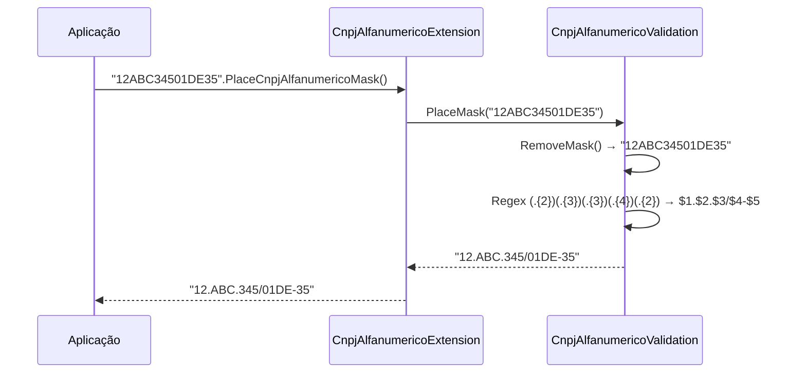

# tec-req-0021 — CNPJ Alfanumérico Máscara (Especificação Técnica)

## Metadados

> **Nota:** Esta seção é uma reflexão do frontmatter YAML (bloco `---` no topo do arquivo) para leitura humana. O frontmatter é a fonte primária; qualquer divergência entre os dois deve ser resolvida atualizando o frontmatter primeiro.

- **Código do documento:** `tec-req-0021`
- **Título:** CNPJ Alfanumérico Máscara — Especificação Técnica
- **Data de criação:** 31/07/2026
- **Última atualização:** 31/07/2026
- **Autor:** Rodrigo Araujo Barbosa
- **Versão:** 1.0.0
- **Status:** Rascunho
- **Requisito de negócio relacionado:** req-0021-cnpj-alfanumerico-mascara.md

## Detalhamento

### Classes e Métodos

```csharp
// Sirb.Validation.Documents.BR.Validation.CnpjAlfanumericoValidation
public static class CnpjAlfanumericoValidation
{
    public static string PlaceMask(string value);
    public static string RemoveMask(string value);
}

// Sirb.Validation.Extensions.CnpjAlfanumericoExtension
public static class CnpjAlfanumericoExtension
{
    public static string PlaceCnpjAlfanumericoMask(this string value);
    public static string RemoveCnpjAlfanumericoMask(this string value);
}
```

### Algoritmo de Máscara (PlaceMask)

1. **Normalização**: Remove pontuação via `RemoveMask(value)` → regex `[./-]` (apenas ponto, barra, hífen)
2. **Validação de comprimento**: Se string resultante tem 14 caracteres, prossegue; caso contrário retorna string normalizada (sem máscara)
3. **Aplicação da máscara**: Regex `(.{2})(.{3})(.{3})(.{4})(.{2})` → `$1.$2.$3/$4-$5`
4. **Retorno**: String formatada `XX.XXX.XXX/XXXX-XX` ou `null` se entrada nula/vazia/whitespace

### Algoritmo de Remoção de Máscara (RemoveMask / RemoveCnpjAlfanumericoMask)

1. **Regex**: `[./-]` — remove apenas caracteres de pontuação (ponto, barra, hífen)
2. **Preservação**: Mantém letras (maiúsculas/minúsculas) e dígitos intactos
3. **Retorno**: String alfanumérica de 14 caracteres (sem pontuação)

### Fluxo de Dados (Mermaid)



### Dependências

- `req-0019` — Validação de CNPJ Alfanumérico (algoritmo base)
- `StringExtension.RemoveMask()` — alias de `OnlyNumbers()` (apenas dígitos) — **não usado aqui**; usa regex específico `[./-]`
- `CnpjAlfanumericoValidation.RemoveMask()` — método interno com regex `[./-]`

## Rastreabilidade

- `Documents/BR/Validation/CnpjAlfanumericoValidation.cs` (métodos `PlaceMask`, `RemoveMask`)
- `Extensions/CnpjAlfanumericoExtension.cs` (extension methods `PlaceCnpjAlfanumericoMask`, `RemoveCnpjAlfanumericoMask`)
- `Extensions/StringExtension.cs` (utilitários de string)

## Histórico

| Data | Autor | Versão | Alteração |
| ---- | ----- | ------ | --------- |
| 31/07/2026 | Rodrigo Araujo Barbosa | 1.0.0 | Criação |