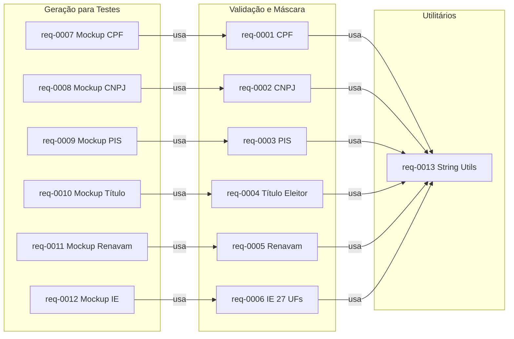

# Mapeamento do Sistema — Sirb.Validation

> **Arquivo de destino:** `docs/system-mapping.md` (raiz de `/docs`).
> Registro contínuo de mapeamento, estrutura de pastas, dependências entre requisitos e evidências.

## Metadados

> **Nota:** Esta seção é uma reflexão do frontmatter YAML (bloco `---` no topo do arquivo) para leitura humana. O frontmatter é a fonte primária; qualquer divergência entre os dois deve ser resolvida atualizando o frontmatter primeiro.

- **Código do documento:** `system-mapping`
- **Título:** Mapeamento do Sistema — Sirb.Validation
- **Data de criação:** 27/07/2026
- **Última atualização:** 27/07/2026
- **Autor:** Rodrigo Araujo Barbosa
- **Versão:** 1.0.0
- **Status:** Aprovado

## 1. Estrutura de Pastas

```
Sirb.Validation/                     # Biblioteca principal (NuGet)
├── Documents/BR/
│   ├── Enumeration/State.cs                    # Enum de 27 UFs + DF
│   ├── Interfaces/
│   │   ├── IInscricaoEstadualValidation.cs     # Contrato de validação de IE
│   │   └── IInscricaoEstadualInternal.cs       # Contrato de geração de IE
│   ├── Mockups/                                # Geradores para testes
│   │   ├── Cpf.cs, Cnpj.cs, Pis.cs, TituloEleitor.cs, Renavam.cs
│   │   ├── InscricaoEstadual.cs                # Facade de geração de IE
│   │   └── Ie/                                 # 27 geradores por estado
│   ├── Rules/                                  # Algoritmos puros
│   │   ├── CpfRule.cs, CnpjRule.cs, PisRule.cs, RenavanRules.cs
│   └── Validation/                             # Orquestração
│       ├── CpfValidation.cs, CnpjValidation.cs, PisValidation.cs
│       ├── TituloEleitorValidation.cs, RenavamValidation.cs
│       ├── RenavamExtension.cs                 # Extension de validação Renavam
│       ├── InscricaoEstadualValidation.cs       # Facade de validação IE
│       └── Ie/                                 # 27 validadores por estado
├── Exceptions/
│   └── StateNotFoundException.cs
├── Extensions/                                 # API pública
│   ├── CpfExtension.cs, CnpjExtension.cs, PisExtension.cs
│   ├── TituloEleitorExtension.cs, StateExtension.cs
│   ├── StringExtension.cs, IntArrayExtension.cs
│   └── *Extension.cs                           # 27 extensões de máscara por estado
```

## 2. Dependências entre Requisitos



## 3. Mapa de Evidências (Código → Requisito)

| Arquivo | Requisito | Função |
| ------- | --------- | ------ |
| `Documents/BR/Validation/CpfValidation.cs` | req-0001 | IsValid, PlaceMask, GetIssuingState |
| `Documents/BR/Rules/CpfRule.cs` | req-0001 | Pesos dos dígitos |
| `Extensions/CpfExtension.cs` | req-0001 | API pública (IsCpfValid, PlaceCpfMask) |
| `Documents/BR/Validation/CnpjValidation.cs` | req-0002 | IsValid, PlaceMask |
| `Documents/BR/Rules/CnpjRule.cs` | req-0002 | Pesos e cálculo de DV |
| `Extensions/CnpjExtension.cs` | req-0002 | API pública |
| `Documents/BR/Validation/PisValidation.cs` | req-0003 | IsValid, PlaceMask, RemoveMask |
| `Documents/BR/Rules/PisRule.cs` | req-0003 | Pesos e DV |
| `Extensions/PisExtension.cs` | req-0003 | API pública |
| `Documents/BR/Validation/TituloEleitorValidation.cs` | req-0004 | IsValid, PlaceMask |
| `Extensions/TituloEleitorExtension.cs` | req-0004 | API pública |
| `Documents/BR/Validation/RenavamValidation.cs` | req-0005 | IsValid |
| `Documents/BR/Validation/RenavamExtension.cs` | req-0005 | API pública |
| `Documents/BR/Rules/RenavanRules.cs` | req-0005 | Soma e cálculo de DV |
| `Documents/BR/Validation/InscricaoEstadualValidation.cs` | req-0006 | Facade IsValid, PlaceMask, RemoveMask |
| `Documents/BR/Validation/Ie/*` (27 arquivos) | req-0006 | Validação por estado |
| `Documents/BR/Interfaces/IInscricaoEstadualValidation.cs` | req-0006 | Contrato |
| `Extensions/*Extension.cs` (27 arquivos) | req-0006 | Máscara por estado |
| `Documents/BR/Enumeration/State.cs` | req-0006 | Enum de estados |
| `Exceptions/StateNotFoundException.cs` | req-0006 | Exceção |
| `Documents/BR/Mockups/Cpf.cs` | req-0007 | Generate |
| `Documents/BR/Mockups/Cnpj.cs` | req-0008 | Generate |
| `Documents/BR/Mockups/Pis.cs` | req-0009 | Generate |
| `Documents/BR/Mockups/TituloEleitor.cs` | req-0010 | Generate |
| `Documents/BR/Mockups/Renavam.cs` | req-0011 | Generate |
| `Documents/BR/Mockups/InscricaoEstadual.cs` | req-0012 | Facade Generate |
| `Documents/BR/Mockups/Ie/*` (27 arquivos) | req-0012 | Geradores por estado |
| `Documents/BR/Interfaces/IInscricaoEstadualInternal.cs` | req-0012 | Contrato de geração |
| `Extensions/StringExtension.cs` | req-0013 | 7 utilitários |
| `Extensions/IntArrayExtension.cs` | req-0013 | ConvertToString (internal) |

## 4. Cobertura dos Requisitos no Código

| Área | Total Arquivos | Requisitos Cobertos |
| ---- | -------------- | ------------------- |
| Rules | 4 | req-0001, 0002, 0003, 0005 |
| Validation | 6 + 27 IE | req-0001 a req-0006 |
| Mockups | 6 + 27 IE | req-0007 a req-0012 |
| Extensions | 34 | req-0001 a req-0006, req-0013 |
| Interfaces | 2 | req-0006, req-0012 |
| Exceptions | 1 | req-0006 |

## 5. Histórico de alterações

| Data | Autor | Versão | Alteração |
| ---- | ----- | ------ | --------- |
| 27/07/2026 | Rodrigo Araujo Barbosa | 1.0.0 | Criação do mapeamento com 13 requisitos e 65+ arquivos de código |
